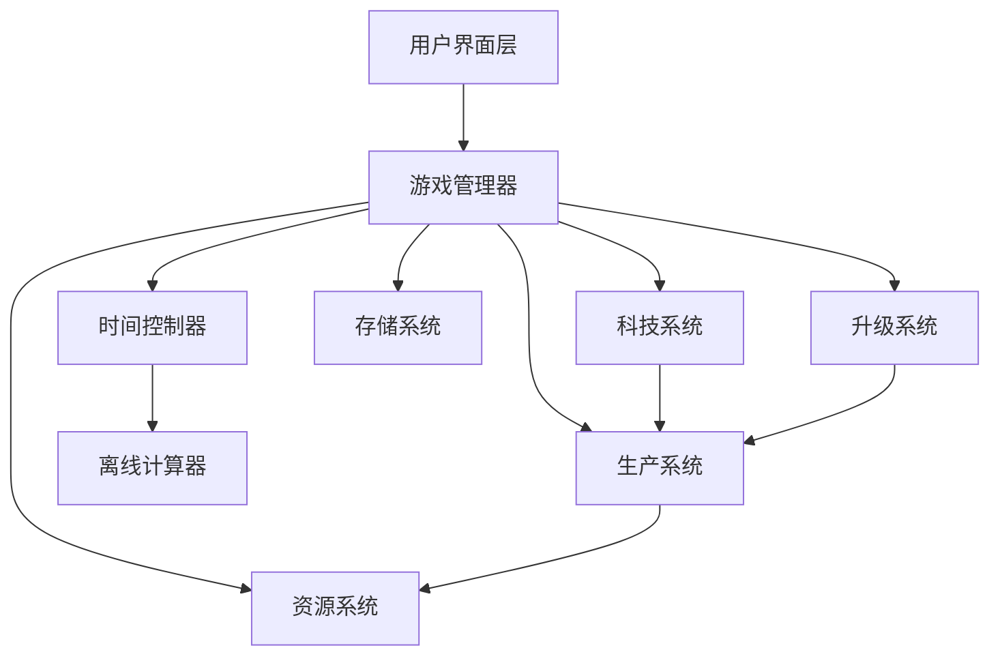

# 设计文档

## 概述

本设计文档描述了Factorio风格放置游戏的技术架构和实现方案。游戏采用基于Web的架构，使用TypeScript/JavaScript开发，支持本地存储和离线计算。核心设计理念是创建一个可扩展的生产系统，支持复杂的资源流动和自动化机制。

## 架构

### 整体架构



### 核心模块

1. **游戏管理器 (GameManager)**: 协调所有子系统，管理游戏状态
2. **资源系统 (ResourceSystem)**: 管理所有资源的存储和流动
3. **生产系统 (ProductionSystem)**: 处理所有生产设施的逻辑
4. **科技系统 (TechnologySystem)**: 管理科技树和解锁机制
5. **时间控制器 (TimeController)**: 处理游戏时间和离线计算
6. **存储系统 (StorageSystem)**: 处理数据持久化

## 组件和接口

### 资源系统

```typescript
interface Resource {
  id: string;
  name: string;
  amount: number;
  maxAmount: number;
  productionRate: number; // 每秒生产量
}

interface ResourceManager {
  resources: Map<string, Resource>;
  addResource(resourceId: string, amount: number): boolean;
  consumeResource(resourceId: string, amount: number): boolean;
  getResource(resourceId: string): Resource | null;
  updateProduction(deltaTime: number): void;
}
```

### 生产系统

```typescript
interface ProductionFacility {
  id: string;
  type: string;
  level: number;
  isActive: boolean;
  inputResources: ResourceRequirement[];
  outputResources: ResourceOutput[];
  productionTime: number; // 生产周期（秒）
  efficiency: number; // 效率倍数
}

interface ProductionChain {
  facilities: ProductionFacility[];
  calculateThroughput(): number;
  updateProduction(deltaTime: number): void;
  checkBottlenecks(): string[];
}
```

### 科技系统

```typescript
interface Technology {
  id: string;
  name: string;
  description: string;
  cost: ResourceRequirement[];
  prerequisites: string[];
  unlocks: string[]; // 解锁的建筑或功能
  isResearched: boolean;
  researchProgress: number;
}

interface TechnologyTree {
  technologies: Map<string, Technology>;
  researchTechnology(techId: string): boolean;
  getAvailableTechnologies(): Technology[];
  checkPrerequisites(techId: string): boolean;
}
```

### 时间和离线系统

```typescript
interface TimeController {
  currentTime: number;
  lastSaveTime: number;
  gameSpeed: number;
  calculateOfflineProgress(offlineTime: number): OfflineResult;
  update(deltaTime: number): void;
}

interface OfflineResult {
  resourcesGained: Map<string, number>;
  facilitiesBuilt: number;
  technologiesResearched: string[];
  maxOfflineHours: number;
}
```

## 数据模型

### 游戏状态

```typescript
interface GameState {
  version: string;
  playerId: string;
  resources: Map<string, Resource>;
  facilities: ProductionFacility[];
  technologies: Map<string, Technology>;
  gameTime: number;
  lastSaveTime: number;
  settings: GameSettings;
}

interface GameSettings {
  autoSave: boolean;
  autoSaveInterval: number; // 秒
  maxOfflineHours: number;
  showNotifications: boolean;
}
```

### 配置数据

```typescript
interface GameConfig {
  resources: ResourceConfig[];
  facilities: FacilityConfig[];
  technologies: TechnologyConfig[];
  recipes: Recipe[];
}

interface Recipe {
  id: string;
  inputs: ResourceRequirement[];
  outputs: ResourceOutput[];
  productionTime: number;
  facilityType: string;
}
```

## 错误处理

### 错误类型

1. **资源不足错误**: 当尝试消耗不存在的资源时
2. **设施状态错误**: 当设施处于无效状态时
3. **存储错误**: 当本地存储失败时
4. **配置错误**: 当游戏配置数据无效时

### 错误处理策略

```typescript
class GameError extends Error {
  constructor(
    message: string,
    public code: string,
    public context?: any
  ) {
    super(message);
  }
}

interface ErrorHandler {
  handleResourceError(error: GameError): void;
  handleProductionError(error: GameError): void;
  handleStorageError(error: GameError): void;
  logError(error: GameError): void;
}
```

### 恢复机制

- 自动保存机制防止数据丢失
- 状态验证确保游戏数据一致性
- 降级模式在出现错误时保持基本功能
- 错误日志记录便于调试

## 测试策略

### 单元测试

1. **资源系统测试**
   - 资源添加和消耗逻辑
   - 生产速率计算
   - 库存上限处理

2. **生产系统测试**
   - 设施生产逻辑
   - 生产链计算
   - 瓶颈检测算法

3. **离线计算测试**
   - 不同离线时长的计算准确性
   - 资源上限约束
   - 生产链平衡

### 集成测试

1. **完整游戏循环测试**
   - 从开始到中期游戏的完整流程
   - 科技解锁和设施建造的集成
   - 离线-在线切换的数据一致性

2. **性能测试**
   - 大量设施时的性能表现
   - 长时间离线计算的效率
   - 内存使用优化

### 用户体验测试

1. **平衡性测试**
   - 游戏进度曲线的合理性
   - 资源获取和消耗的平衡
   - 科技解锁节奏

2. **界面可用性测试**
   - 关键信息的可见性
   - 操作流程的直观性
   - 移动设备适配

## 性能考虑

### 优化策略

1. **计算优化**
   - 使用增量计算减少重复运算
   - 批量处理资源更新
   - 智能的离线计算算法

2. **内存管理**
   - 对象池复用减少GC压力
   - 延迟加载非关键数据
   - 定期清理无用状态

3. **存储优化**
   - 压缩存储格式
   - 增量保存机制
   - 异步存储操作

### 扩展性设计

- 模块化架构支持功能扩展
- 配置驱动的内容系统
- 插件式的生产设施设计
- 可扩展的科技树结构