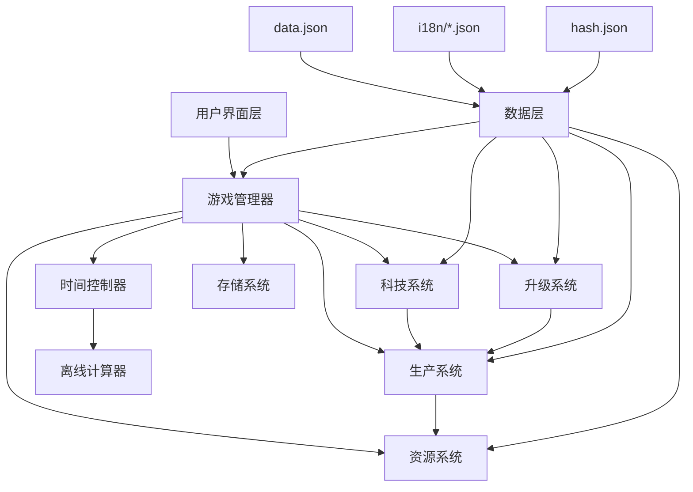

# 设计文档

## 概述

本设计文档描述了 Factorio 风格放置游戏的技术架构和实现方案。游戏采用基于 Web 的架构，使用 TypeScript/JavaScript 开发，支持本地存储和离线计算。核心设计理念是创建一个**数据驱动**的可扩展生产系统，所有游戏内容(物品、配方、科技、机器等)都从 data.json 中动态加载，避免硬编码。

## 架构

### 整体架构



### 核心模块

1. **游戏管理器 (GameManager)**: 协调所有子系统，管理游戏状态
2. **资源系统 (ResourceSystem)**: 管理所有资源的存储和流动
3. **生产系统 (ProductionSystem)**: 处理所有生产设施的逻辑
4. **科技系统 (TechnologySystem)**: 管理科技树和解锁机制
5. **时间控制器 (TimeController)**: 处理游戏时间和离线计算
6. **存储系统 (StorageSystem)**: 处理数据持久化

## 组件和接口

### 资源系统

```typescript
interface Resource {
  id: string;
  name: string;
  amount: number;
  maxAmount: number;
  productionRate: number; // 每秒生产量
}

interface ResourceManager {
  resources: Map<string, Resource>;
  addResource(resourceId: string, amount: number): boolean;
  consumeResource(resourceId: string, amount: number): boolean;
  getResource(resourceId: string): Resource | null;
  updateProduction(deltaTime: number): void;
}
```

### 能源系统

能源系统管理电力生产、分配和消耗，支持多种能源类型：

```typescript
// 能源类型
interface PowerSystem {
  totalPowerGeneration: number; // 总发电量 (kW)
  totalPowerConsumption: number; // 总耗电量 (kW)
  powerSatisfaction: number; // 电力满足率 (0-1)

  // 电力存储系统
  totalStorageCapacity: number; // 总存储容量 (MJ)
  currentStoredPower: number; // 当前存储电量 (MJ)
  storageEfficiency: number; // 存储效率 (0-1)

  generators: PowerGenerator[]; // 发电设施
  consumers: PowerConsumer[]; // 耗电设施
  accumulators: Accumulator[]; // 蓄电池

  updatePowerBalance(): void;
  calculatePowerSatisfaction(): number;
  updatePowerStorage(deltaTime: number): void;
}

// 蓄电池系统
interface Accumulator {
  id: string;
  maxCapacity: number; // 最大容量 (MJ)
  currentCharge: number; // 当前电量 (MJ)
  chargeRate: number; // 充电速率 (kW)
  dischargeRate: number; // 放电速率 (kW)
  efficiency: number; // 充放电效率
  isCharging: boolean;
  isDischarging: boolean;
}

// 发电设施
interface PowerGenerator {
  id: string;
  type: "steam-engine" | "solar-panel" | "nuclear-reactor" | "fusion-reactor";
  maxPowerOutput: number; // 最大发电量 (kW)
  currentPowerOutput: number; // 当前发电量 (kW)
  efficiency: number; // 发电效率
  fuelConsumption?: number; // 燃料消耗率 (单位/秒)
  isActive: boolean;
}

// 耗电设施
interface PowerConsumer {
  id: string;
  type: string;
  powerUsage: number; // 工作功耗 (kW)
  drainUsage: number; // 待机功耗 (kW)
  isActive: boolean;
  powerSatisfied: boolean; // 是否有足够电力
}

// 燃料系统
interface FuelSystem {
  fuels: Map<string, Fuel>;

  getFuelValue(fuelId: string): number;
  consumeFuel(facilityId: string, fuelType: string, amount: number): boolean;
  calculateBurnTime(fuelId: string, powerDemand: number): number;
}

interface Fuel {
  id: string;
  category: "chemical" | "nuclear" | "nutrients" | "food" | "fluid";
  energyValue: number; // 能量值 (MJ)
  burnRate: number; // 燃烧速率
}
```

#### 能源机制详解

**电力生产**：

- **蒸汽机**: 消耗燃料(煤炭、木材等)产生电力，需要水和燃料
- **太阳能板**: 白天自动发电，无燃料消耗，夜间停止
- **核反应堆**: 消耗核燃料，持续高功率发电
- **聚变反应堆**: 最高级发电设施，消耗聚变燃料

**电力消耗**：

- **工作功耗(usage)**: 设施工作时的电力消耗
- **待机功耗(drain)**: 设施空闲时的基础电力消耗
- **功耗计算**: `总功耗 = Σ(工作设施的usage) + Σ(所有设施的drain)`

**电力存储机制**：

- **无蓄电池时**: 电力无法存储，发电量 < 消耗量时所有设施按电力满足率降低效率
- **有蓄电池时**: 多余电力自动存储，电力不足时自动放电
- **存储优先级**: 发电量 > 消耗量时充电，发电量 < 消耗量时放电
- **夜间供电**: 太阳能+蓄电池组合，白天充电夜间放电

**电力平衡算法**：

```typescript
function updatePowerBalance(powerSystem: PowerSystem, deltaTime: number) {
  const generation = calculateTotalGeneration();
  const consumption = calculateTotalConsumption();
  const surplus = generation - consumption;

  if (surplus > 0) {
    // 有多余电力，优先充电
    chargeAccumulators(surplus, deltaTime);
    powerSystem.powerSatisfaction = 1.0;
  } else if (surplus < 0) {
    // 电力不足，尝试放电
    const discharged = dischargeAccumulators(-surplus, deltaTime);
    powerSystem.powerSatisfaction = (generation + discharged) / consumption;
  } else {
    powerSystem.powerSatisfaction = 1.0;
  }
}
```

**燃料系统**：

```typescript
// 燃料能量值示例
const fuelValues = {
  wood: 2, // 木材: 2MJ
  coal: 4, // 煤炭: 4MJ
  "solid-fuel": 12, // 固体燃料: 12MJ
  "rocket-fuel": 100, // 火箭燃料: 100MJ
  "uranium-fuel-cell": 8000, // 铀燃料棒: 8000MJ
  "fusion-power-cell": 40000, // 聚变燃料: 40000MJ
};
```

**自动化生产流程**：

1. **电力效率**: 根据电网的电力满足率调整设施生产效率
2. **燃料供应**: 燃料驱动设施自动消耗燃料库存
3. **生产执行**: 满足条件时按配方进行生产
4. **资源流动**: 自动从输入库存消耗资源，向输出库存添加产品
5. **效率计算**: 根据电力满足率、燃料供应和模块效果调整实际生产效率

**生产效率计算示例**：

```typescript
function calculateProductionEfficiency(
  facility: ProductionFacility,
  powerSatisfaction: number
): number {
  let efficiency = 1.0;

  // 1. 电力效率影响
  if (facility.powerType === "electric") {
    efficiency *= powerSatisfaction; // 电力不足时按比例降低效率
  }

  // 2. 燃料供应影响
  if (facility.powerType === "burner" && !facility.hasFuel) {
    efficiency = 0; // 燃料驱动设施没有燃料时完全停止
  }

  // 3. 模块效果影响
  const moduleSpeedBonus = calculateModuleSpeedBonus(facility.installedModules);
  efficiency *= 1 + moduleSpeedBonus;

  // 4. 资源供应影响
  if (!facility.hasInputs || !facility.hasOutputSpace) {
    efficiency = 0; // 没有输入资源或输出空间时停止
  }

  return Math.max(0, Math.min(efficiency, 10)); // 限制在0-10倍之间
}
```

### 生产系统

```typescript
interface ProductionFacility {
  id: string;
  type: string;
  level: number;
  isActive: boolean;

  // 生产配置
  currentRecipe: Recipe | null;
  productionProgress: number;      // 当前生产进度 (0-1)
  productionSpeed: number;         // 生产速度倍数

  // 能源配置
  powerType: 'electric' | 'burner';
  powerUsage: number;              // 工作功耗 (kW)
  drainUsage: number;              // 待机功耗 (kW)
  fuelCategories?: string[];       // 可用燃料类型
  currentFuel?: string;            // 当前燃料类型
  fuelAmount: number;              // 燃料库存

  // 模块系统
  moduleSlots: number;
  installedModules: Module[];

  // 状态管理
  powerEfficiency: number;         // 电力效率 (0-1，基于电网电力满足率)
  hasFuel: boolean;                // 是否有燃料(燃料驱动设施)
  hasInputs: boolean;              // 是否有足够输入资源
  hasOutputSpace: boolean;         // 是否有输出空间
  actualEfficiency: number;        // 实际生产效率 (综合电力、燃料、模块效果)

  // 方法
  canProduce(): boolean;
  startProduction(): void;
  updateProduction(deltaTime: number): void;
  completeProduction(): void;
}

interface ProductionChain {
  facilities: ProductionFacility[];
  calculateThroughput(): number;
  updateProduction(deltaTime: number): void;
  checkBottlenecks(): string[];
}

// 模块系统
interface Module {
  id: string;
  type: 'speed' | 'productivity' | 'efficiency' | 'quality';
  speedBonus?: number;             // 速度加成
  productivityBonus?: number;      // 产能加成
  efficiencyBonus?: number;        // 效率加成 (减少功耗)
  qualityBonus?: number;           // 品质加成
  powerConsumptionMultiplier: number; // 功耗倍数
}

// 自动化生产管理器
interface AutomationManager {
  facilities: Map<string, ProductionFacility>;

  // 自动化逻辑
  updateAllFacilities(deltaTime: number): void;
  checkResourceAvailability(facility: ProductionFacility): boolean;
  calculatePowerEfficiency(facility: ProductionFacility): number;
  checkFuelAvailability(facility: ProductionFacility): boolean;

  // 资源分配
  allocateResources(facility: ProductionFacility): boolean;
  consumeInputs(facility: ProductionFacility): void;
  produceOutputs(facility: ProductionFacility): void;

  // 燃料管理
  consumeFuel(facility: ProductionFacility, deltaTime: number): void;
  refuelFacility(facility: ProductionFacility): boolean;
}
```

### 手动操作系统

手动操作系统管理玩家的直接交互，包括资源采集和物品制作：

```typescript
interface ManualOperationSystem {
  // 手动采集
  harvestableResources: Map<string, HarvestableResource>;

  // 手动制作
  craftableItems: Map<string, CraftableItem>;

  // 操作方法
  harvestResource(resourceId: string): boolean;
  craftItem(itemId: string, quantity: number): boolean;
  canHarvest(resourceId: string): boolean;
  canCraft(itemId: string, quantity: number): boolean;
}

// 可采集资源
interface HarvestableResource {
  id: string;
  name: string;
  harvestAmount: number;           // 每次采集数量
  harvestTime: number;             // 采集时间(秒)
  cooldownTime: number;            // 冷却时间(秒)
  lastHarvestTime: number;         // 上次采集时间
  maxAvailable: number;            // 地图上可采集的总量
  currentAvailable: number;        // 当前可采集数量
  regenerationRate?: number;       // 再生速率(单位/秒)
}

// 可制作物品
interface CraftableItem {
  id: string;
  name: string;
  recipe: Recipe;
  craftTime: number;               // 制作时间(秒)
  canManualCraft: boolean;         // 是否可手动制作
  requiredTechnology?: string;     // 需要的科技
}

// 手动操作管理器
interface ManualCraftingManager {
  // 判断物品是否可手动制作
  canManualCraft(itemId: string): boolean;

  // 判断资源是否可手动采集
  canManualHarvest(resourceId: string): boolean;

  // 执行手动制作
  performManualCraft(itemId: string, quantity: number): CraftResult;

  // 执行手动采集
  performManualHarvest(resourceId: string): HarvestResult;
}

interface CraftResult {
  success: boolean;
  itemsProduced: number;
  resourcesConsumed: ResourceRequirement[];
  timeRequired: number;
}

interface HarvestResult {
  success: boolean;
  resourcesGained: number;
  cooldownRemaining: number;
}
```

#### 手动操作机制详解

**资源采集规则**：

- **可手动采集**: 木材(砍树)、石头(采石)、铁矿、铜矿、煤炭等固体资源
- **需要机器采集**: 石油、天然气等流体资源需要抽油机
- **采集机制**: 手动采集有动画时间，不同资源采集速度不同
- **资源再生**: 树木可以重新种植，矿物资源有限但矿脉很大
- **早期依赖**: 游戏开始时可以手动采集所有基础资源(木材、石头、矿物)
- **效率对比**: 手动采集速度远低于机器，激励玩家建设自动化采矿

**手动制作规则**：

```typescript
// 手动制作判断逻辑
function canManualCraft(item: FactorioItem): boolean {
  // 1. 检查是否有对应的制作配方
  const recipe = findRecipeByOutput(item.id);
  if (!recipe) return false;

  // 2. 检查配方是否已解锁
  if (recipe.isLocked && !isTechnologyResearched(recipe.requiredTechnology)) {
    return false;
  }

  // 3. 检查是否可以手动制作
  // 根据Factorio Wiki，大部分物品都可以手动制作，除了特殊情况
  return !isManualCraftingExcluded(recipe);
}

// 无法手动制作的物品类型
function isManualCraftingExcluded(recipe: FactorioRecipe): boolean {
  // 1. 检查配方是否涉及流体
  const hasFluidInput = Object.keys(recipe.in).some((inputId) => isFluid(inputId));
  const hasFluidOutput = Object.keys(recipe.out).some((outputId) => isFluid(outputId));

  if (hasFluidInput || hasFluidOutput) {
    return true; // 任何涉及流体的配方都无法手动制作
  }

  // 2. 检查是否需要特殊设施
  // 玩家只能模拟基础组装机的功能
  const specialFacilities = [
    "oil-refinery",
    "chemical-plant",
    "centrifuge",
    "rocket-silo",
    "nuclear-reactor",
    "foundry",
    "stone-furnace",
    "steel-furnace",
    "electric-furnace",
    "electromagnetic-plant",
    "cryogenic-plant",
    "biochamber",
    "agricultural-tower",
    "lab",
    "biolab",
    "spoilage" // 特殊过程，非机器
  ];

  // 如果配方只能在特殊设施中制作，则无法手动制作
  if (
    recipe.producers.every((producer) => specialFacilities.includes(producer))
  ) {
    return true;
  }

  // 其他配方（主要是标准组装机配方）可以手动制作
  return false;
}

// 判断物品ID是否为流体
function isFluid(itemId: string): boolean {
  // 从data.json中获取物品信息，检查category是否为'fluids'
  const item = getItemFromData(itemId);
  return item?.category === "fluids";
}
```

**采集示例**：

```typescript
const harvestableResources = {
  // 地表资源 - 采集速度快
  wood: {
    id: "wood",
    harvestAmount: 4, // 每次采集4个木材
    harvestTime: 0.5, // 0.5秒采集时间
    cooldownTime: 1.0, // 1秒冷却
    maxAvailable: 1000, // 地图上最多1000个
    regenerationRate: 0.1, // 每秒再生0.1个(可重新种植)
  },
  stone: {
    id: "stone",
    harvestAmount: 2,
    harvestTime: 1.0,
    cooldownTime: 2.0,
    maxAvailable: 500,
    regenerationRate: 0, // 石头不再生
  },

  // 矿物资源 - 采集速度慢，但储量大
  "iron-ore": {
    id: "iron-ore",
    harvestAmount: 1, // 每次采集1个铁矿
    harvestTime: 2.0, // 2秒采集时间(比机器慢很多)
    cooldownTime: 1.0, // 1秒冷却
    maxAvailable: 10000, // 矿脉储量大
    regenerationRate: 0, // 矿物不再生
  },
  "copper-ore": {
    id: "copper-ore",
    harvestAmount: 1,
    harvestTime: 2.0,
    cooldownTime: 1.0,
    maxAvailable: 8000,
    regenerationRate: 0,
  },
  coal: {
    id: "coal",
    harvestAmount: 1,
    harvestTime: 2.5, // 煤炭稍难采集
    cooldownTime: 1.0,
    maxAvailable: 6000,
    regenerationRate: 0,
  },
};
```

**采集效率对比**：

```typescript
// 手动采集 vs 机器采集效率对比
const harvestingEfficiency = {
  "iron-ore": {
    manual: 0.5, // 手动: 0.5个/秒 (2秒采集1个)
    burnerDrill: 0.25, // 燃料采矿机: 0.25个/秒
    electricDrill: 0.5, // 电力采矿机: 0.5个/秒
  },
  wood: {
    manual: 2.0, // 手动砍树: 2个/秒 (快速)
    // 木材没有专用采集机器
  },
};
```

**手动制作特点**：

- **可制作范围**: 大部分物品都可以手动制作，包括电路板、齿轮、弹药等
- **无法手动制作**: 涉及流体的配方、熔炼配方、特殊设施专用配方
- **制作速度**: 手动制作速度固定为 0.5 倍(比机器慢)
- **无加成效果**: 无法享受模块加成、科技加成和生产力奖励
- **便携性**: 随时随地可以制作，不需要电力和设施

**手动制作示例**：

```typescript
const manualCraftableItems = {
  // ✅ 可以手动制作
  "iron-gear-wheel": { craftTime: 1.0, baseTime: 0.5 }, // 2倍时间
  "electronic-circuit": { craftTime: 1.0, baseTime: 0.5 },
  "transport-belt": { craftTime: 1.0, baseTime: 0.5 },
  inserter: { craftTime: 1.0, baseTime: 0.5 },
  "assembling-machine-1": { craftTime: 1.0, baseTime: 0.5 },

  // ❌ 无法手动制作
  "iron-plate": false, // 需要熔炉熔炼
  "petroleum-gas": false, // 流体，需要炼油厂
  "sulfuric-acid": false, // 流体，需要化工厂
  "plastic-bar": false, // 需要石油气(流体输入)
  battery: false, // 需要硫酸(流体输入)
  "engine-unit": false, // 需要润滑油(流体输入)
  "uranium-fuel-cell": false, // 需要离心机
  concrete: false, // 需要水(流体输入)
};

// 配方系统
interface Recipe {
id: string;
name: string;
category: string;
productionTime: number;
inputs: ResourceRequirement[];
outputs: ResourceOutput[];
producers: string[]; // 可生产的机器列表
isLocked: boolean; // 是否需要科技解锁
allowedEffects?: string[]; // 允许的模块效果
}

interface RecipeManager {
recipes: Map<string, Recipe>;
unlockedRecipes: Set<string>;

// 检查配方是否已解锁
isRecipeUnlocked(recipeId: string): boolean;

// 检查配方是否已解锁
isRecipeUnlocked(recipeId: string): boolean;

// 解锁配方（由科技系统调用）
unlockRecipe(recipeId: string): void;

// 获取可用配方列表
getAvailableRecipes(): Recipe[];

// 根据输出物品查找配方
findRecipesByOutput(itemId: string): Recipe[];
}
```

#### 配方锁定机制

**配方状态分类**：
- **默认解锁配方**：基础配方如木箱、铁箱等，游戏开始时即可使用
- **科技锁定配方**：标记为`"locked"`的配方，需要通过科技研究解锁

**解锁流程**：
1. 游戏开始时，只有未标记`"locked"`的配方可用
2. 科技研究完成时，解锁该科技的`unlockedRecipes`列表中的所有配方
3. 配方解锁后，玩家可以在相应的生产设施中使用该配方
4. UI界面显示配方的锁定状态和解锁条件

**配方示例**：
```typescript
// 默认解锁的基础配方
const woodenChestRecipe: Recipe = {
  id: "wooden-chest",
  name: "Wooden chest",
  category: "logistics",
  productionTime: 0.5,
  inputs: [{ id: "wood", amount: 2 }],
  outputs: [{ id: "wooden-chest", amount: 1 }],
  producers: ["assembling-machine-1", "assembling-machine-2", "assembling-machine-3"],
  isLocked: false
};

// 需要科技解锁的配方
const steelChestRecipe: Recipe = {
  id: "steel-chest",
  name: "Steel chest",
  category: "logistics",
  productionTime: 0.5,
  inputs: [{ id: "steel-plate", amount: 8 }],
  outputs: [{ id: "steel-chest", amount: 1 }],
  producers: ["assembling-machine-1", "assembling-machine-2", "assembling-machine-3"],
  isLocked: true  // 需要通过"steel-processing"科技解锁
};
```

### 科技系统

科技系统管理研究进度和解锁新配方，支持两种解锁方式：

1. **传统研究解锁**：通过实验室消耗科学包进行研究
2. **触发式自动解锁**：满足特定条件时自动完成

```typescript
interface TechnologySystem {
  researchedTechnologies: Set<string>;
  currentResearch: string | null;
  researchProgress: number;

  // 检查科技是否可以研究（前置依赖已满足）
  canResearch(techId: string): boolean;

  // 检查科技是否满足自动解锁条件
  checkResearchTriggers(): void;

  // 开始传统研究
  startResearch(techId: string): void;

  // 更新研究进度
  updateResearch(deltaTime: number): void;

  // 完成科技研究
  completeResearch(techId: string): void;

  // 获取科技解锁的配方列表
  getUnlockedRecipes(techId: string): string[];
}

// 科技触发器类型
interface ResearchTrigger {
  type:
    | "craft-item"
    | "build-entity"
    | "mine-entity"
    | "create-space-platform"
    | "capture-spawner";
  item?: string; // craft-item类型需要
  entity?: string; // build-entity, mine-entity类型需要
  count?: number; // 需要的数量
}

// 科技数据结构
interface Technology {
  id: string;
  name: string;
  prerequisites: string[]; // 前置科技依赖
  unlockedRecipes: string[]; // 解锁的配方
  researchTrigger?: ResearchTrigger; // 自动解锁触发条件
  researchCost?: {
    // 传统研究成本
    [sciencePackId: string]: number;
  };
  researchTime?: number; // 研究时间（秒）
  isResearched: boolean;
  researchProgress: number;
}

interface TechnologyTree {
  technologies: Map<string, Technology>;
  researchTechnology(techId: string): boolean;
  getAvailableTechnologies(): Technology[];
  checkPrerequisites(techId: string): boolean;
}
```

#### 科技解锁机制

**前置依赖检查**：

- 科技必须满足所有 prerequisites 中列出的前置科技
- 使用深度优先搜索验证依赖链完整性
- 支持多重依赖（一个科技可以依赖多个前置科技）

**自动解锁触发器**：

- `craft-item`: 制造指定物品达到数量时解锁（如制造 50 个铁板解锁蒸汽动力）
- `build-entity`: 建造指定建筑时解锁（如建造小行星收集器解锁太空科学包）
- `mine-entity`: 开采指定资源时解锁（如开采原油解锁石油加工）
- `create-space-platform`: 创建太空平台时解锁
- `capture-spawner`: 捕获生物巢穴时解锁

**解锁流程**：

1. 游戏持续监控玩家行为（制造、建造、开采等）
2. 检查是否满足任何科技的 researchTrigger 条件
3. 满足条件时自动完成科技研究
4. 解锁科技的 unlockedRecipes 中列出的所有配方
5. 更新可研究科技列表（检查新的前置依赖）

**科技类型示例**：

```typescript
// 自动解锁科技示例
const steamPowerTech: Technology = {
  id: "steam-power",
  name: "Steam power",
  prerequisites: [],
  unlockedRecipes: ["pipe", "pipe-to-ground", "steam-engine"],
  researchTrigger: {
    type: "craft-item",
    item: "iron-plate",
    count: 50,
  },
  isResearched: false,
  researchProgress: 0,
};

// 传统研究科技示例
const automationScienceTech: Technology = {
  id: "automation-science-pack-technology",
  name: "Automation science pack",
  prerequisites: ["steam-power", "electronics"],
  unlockedRecipes: ["automation-science-pack"],
  researchCost: {
    "automation-science-pack": 10,
  },
  researchTime: 5,
  isResearched: false,
  researchProgress: 0,
};
```

### 时间和离线系统

```typescript
interface TimeController {
  currentTime: number;
  lastSaveTime: number;
  gameSpeed: number;
  calculateOfflineProgress(offlineTime: number): OfflineResult;
  update(deltaTime: number): void;
}

interface OfflineResult {
  resourcesGained: Map<string, number>;
  facilitiesBuilt: number;
  technologiesResearched: string[];
  maxOfflineHours: number;
}
```

## 数据模型

### 游戏状态

```typescript
interface GameState {
  version: string;
  playerId: string;
  resources: Map<string, Resource>;
  facilities: ProductionFacility[];
  technologies: Map<string, Technology>;
  gameTime: number;
  lastSaveTime: number;
  settings: GameSettings;
  language: string; // 当前语言设置
}

interface GameSettings {
  autoSave: boolean;
  autoSaveInterval: number; // 秒
  maxOfflineHours: number;
  showNotifications: boolean;
}
```

### Factorio 数据结构适配

```typescript
// 完整的Factorio数据结构
interface FactorioData {
  version: {
    base: string;
    "elevated-rails": string;
    quality: string;
    "space-age": string;
  };
  categories: FactorioCategory[];
  icons: FactorioIcon[];
  items: FactorioItemUnion[];
  recipes: FactorioRecipe[];
  locations: FactorioLocation[];
  defaults: FactorioDefaults;
}

interface FactorioCategory {
  id: string;
  name: string;
  icon?: string;
}

interface FactorioIcon {
  id: string;
  position: string; // CSS background-position格式
  color?: string; // 主色调，用于UI着色
}

// 基础物品接口
interface FactorioItemBase {
  id: string;
  name: string;
  category: string;
  stack: number; // 堆叠数量
  row: number; // UI排序行
  flags?: string[]; // 如["locked"]表示需要解锁
  icon?: string; // 自定义图标（如果与id不同）
  iconText?: string; // 图标上显示的文本（如科技等级"2"、温度"500°"等）
}

// 普通物品（资源、中间产品等）
interface FactorioItem extends FactorioItemBase {
  category:
    | "logistics"
    | "production"
    | "intermediate-products"
    | "space"
    | "combat"
    | "fluids"
    | "other";
}

// 生产设施
interface FactorioMachine extends FactorioItemBase {
  category: "production";
  machine: {
    speed: number; // 生产速度倍数
    modules?: number; // 模块插槽数量
    type?: "electric" | "burner"; // 能源类型
    fuelCategories?: string[]; // 燃料类型
    usage?: number; // 功耗/燃料消耗
    drain?: number; // 待机功耗
    pollution?: number; // 污染产生
    size: [number, number]; // 建筑尺寸
    entityType?: string; // 实体类型
    locations?: string[]; // 可建造的星球
    disallowedEffects?: string[]; // 禁用的模块效果
    hideRate?: boolean; // 是否隐藏生产速率
  };
}

// 传送带
interface FactorioBelt extends FactorioItemBase {
  category: "logistics";
  belt: {
    speed: number; // 传送速度
  };
}

// 信标
interface FactorioBeacon extends FactorioItemBase {
  category: "production";
  beacon: {
    effectivity: number; // 效果倍数
    modules: number; // 模块插槽数量
    range: number; // 影响范围
    type: "electric"; // 能源类型
    usage: number; // 功耗
    disallowedEffects?: string[]; // 禁用的模块效果
    size: [number, number]; // 建筑尺寸
  };
}

// 模块
interface FactorioModule extends FactorioItemBase {
  category: "production";
  module: {
    consumption?: number; // 功耗影响（正数增加，负数减少）
    speed?: number; // 速度影响
    productivity?: number; // 产能影响
    quality?: number; // 品质影响
    pollution?: number; // 污染影响
  };
}

// 燃料
interface FactorioFuel extends FactorioItemBase {
  fuel: {
    category: string; // 燃料类型（chemical, nuclear, nutrients, food, fluid等）
    value: number; // 燃料值（能量单位）
  };
}

// 科技
interface FactorioTechnology extends FactorioItemBase {
  category: "technology";
  technology: {
    prerequisites?: string[]; // 前置科技
    unlockedRecipes?: string[]; // 解锁的配方
    prodUpgrades?: string[]; // 生产力升级影响的配方列表
  };
}

// 异星工厂管道
interface FactorioPipe extends FactorioItemBase {
  category: "logistics";
  pipe: {
    speed: number; // 管道速度
  };
}

// 异星工厂货运车厢
interface FactorioCargoWagon extends FactorioItemBase {
  category: "logistics";
  cargoWagon: {
    size: number; // 货运车厢尺寸
  };
}

// 异星工厂流体车厢
interface FactorioFluidWagon extends FactorioItemBase {
  category: "logistics";
  fluidWagon: {
    capacity: number; // 流体车厢容量
  };
}

// 联合类型，表示所有可能的物品类型
type FactorioItemUnion =
  | FactorioItem
  | FactorioMachine
  | FactorioBelt
  | FactorioBeacon
  | FactorioModule
  | FactorioFuel
  | FactorioTechnology
  | FactorioPipe
  | FactorioCargoWagon
  | FactorioFluidWagon;

interface FactorioRecipe {
  id: string;
  name: string;
  category: string;
  row: number;
  time: number; // 生产时间（秒）
  producers: string[]; // 可生产的机器列表
  in: Record<string, number>; // 输入资源
  out: Record<string, number>; // 输出资源
  catalyst?: Record<string, number>; // 催化剂
  cost?: number; // 成本
  flags?: string[]; // 如["locked"]
  disallowedEffects?: string[]; // 禁用的模块效果
  icon?: string; // 自定义图标（如果与id不同）
  iconText?: string; // 图标上显示的文本（如科技等级等）
  locations?: string[]; // 可用地点
  researchTrigger?: { // 研究触发器
    type: string;
    item?: string;
    count?: number;
    entity?: string;
  };
  count?: number; // 数量
}

// 注意：FactorioTechnology现在已经在上面的联合类型中定义

interface FactorioLocation {
  id: string;
  name: string;
  icon?: string;
}

interface FactorioDefaults {
  beacon: string;
  belt: string;
  fuelRank: string[];
  cargoWagon: string;
  fluidWagon: string;
  excludedRecipes: string[];
  pipe: string;
  presets: FactorioPreset[];
}

interface FactorioPreset {
  id: number;
  label: string;
  belt: string;
  beltStack?: number;
  machineRank: string[];
  moduleRank?: string[];
  beacon?: string;
  beaconCount?: number;
  beaconModule?: string;
}

// 品质系统支持（基于hash.json中的(1)(2)(3)(5)后缀）
interface QualityItem extends FactorioItem {
  quality: 1 | 2 | 3 | 5; // 普通、优秀、稀有、史诗、传奇
  baseId: string; // 基础物品ID（去除品质后缀）
}
```

### 图标和本地化系统

```typescript
// 图标精灵图系统
interface IconSystem {
  spriteUrl: string; // icons.webp的URL
  iconSize: number; // 单个图标尺寸（66px）
  getIconStyle(id: string): {
    // 获取图标CSS样式
    backgroundImage: string;
    backgroundPosition: string;
    width: string;
    height: string;
  };
}

// 多语言本地化数据
interface LocalizationData {
  categories: Record<string, string>; // 分类名称
  items: Record<string, string>; // 物品名称
  recipes: Record<string, string>; // 配方名称
  technologies?: Record<string, string>; // 科技名称（部分语言可能没有）
}

// 本地化管理器
interface LocalizationManager {
  currentLanguage: string;
  availableLanguages: string[];
  data: Record<string, LocalizationData>;

  setLanguage(lang: string): void;
  translate(key: string, type: "items" | "recipes" | "categories"): string;
  getLocalizedName(item: FactorioItem): string;
}
```

### 数据处理和适配层

```typescript
// 数据加载和处理器
interface FactorioDataProcessor {
  loadData(): Promise<FactorioData>;
  loadLocalization(language: string): Promise<LocalizationData>;

  // 数据转换方法
  convertToGameItems(factorioItems: FactorioItemUnion[]): GameItem[];
  convertToGameRecipes(factorioRecipes: FactorioRecipe[]): GameRecipe[];
  convertToGameTechnologies(
    factorioTechnologies: FactorioTechnology[]
  ): GameTechnology[];

  // 类型过滤方法
  filterMachines(items: FactorioItemUnion[]): FactorioMachine[];
  filterTechnologies(items: FactorioItemUnion[]): FactorioTechnology[];
  filterModules(items: FactorioItemUnion[]): FactorioModule[];
  filterBeacons(items: FactorioItemUnion[]): FactorioBeacon[];

  // 品质系统处理
  parseQualityItems(hashData: { items: string[] }): QualityItem[];
  getBaseItemId(qualityItemId: string): string;
  getQualityLevel(qualityItemId: string): number;

  // 生产链分析
  buildProductionChains(): ProductionChainMap;
  findProducers(itemId: string): FactorioMachine[];
  findConsumers(itemId: string): FactorioRecipe[];

  // 类型检查辅助方法
  isMachine(item: FactorioItemUnion): item is FactorioMachine;
  isTechnology(item: FactorioItemUnion): item is FactorioTechnology;
  isModule(item: FactorioItemUnion): item is FactorioModule;
  isBeacon(item: FactorioItemUnion): item is FactorioBeacon;
  isFluid(itemId: string): boolean;

  // 手动制作检查方法
  canManualCraft(recipeId: string): boolean;
  canManualHarvest(itemId: string): boolean;
}

// 游戏数据适配
interface GameItem {
  id: string;
  name: string;
  localizedName: string;
  category: string;
  stackSize: number;
  iconId: string;
  quality: number;
  isLocked: boolean;

  // 生产设施属性
  productionSpeed?: number;
  powerConsumption?: number;
  moduleSlots?: number;
  allowedEffects?: string[];
  buildingSize?: [number, number];
  availableLocations?: string[];
}

interface GameRecipe {
  id: string;
  name: string;
  localizedName: string;
  category: string;
  productionTime: number;
  inputs: ResourceRequirement[];
  outputs: ResourceOutput[];
  producers: string[];
  isLocked: boolean;
  allowedEffects?: string[];
}

interface GameTechnology {
  id: string;
  name: string;
  localizedName: string;
  prerequisites: string[];
  unlockedRecipes: string[];
  unlockedItems: string[];
  researchCost?: ResourceRequirement[]; // 需要从其他数据源获取
  isResearched: boolean;
}
```

## 错误处理

### 错误类型

1. **资源不足错误**: 当尝试消耗不存在的资源时
2. **设施状态错误**: 当设施处于无效状态时
3. **存储错误**: 当本地存储失败时
4. **配置错误**: 当游戏配置数据无效时

### 错误处理策略

```typescript
class GameError extends Error {
  constructor(message: string, public code: string, public context?: any) {
    super(message);
  }
}

interface ErrorHandler {
  handleResourceError(error: GameError): void;
  handleProductionError(error: GameError): void;
  handleStorageError(error: GameError): void;
  logError(error: GameError): void;
}
```

### 恢复机制

- 自动保存机制防止数据丢失
- 状态验证确保游戏数据一致性
- 降级模式在出现错误时保持基本功能
- 错误日志记录便于调试

## 测试策略

### 单元测试

1. **资源系统测试**

   - 资源添加和消耗逻辑
   - 生产速率计算
   - 库存上限处理

2. **生产系统测试**

   - 设施生产逻辑
   - 生产链计算
   - 瓶颈检测算法

3. **离线计算测试**
   - 不同离线时长的计算准确性
   - 资源上限约束
   - 生产链平衡

### 集成测试

1. **完整游戏循环测试**

   - 从开始到中期游戏的完整流程
   - 科技解锁和设施建造的集成
   - 离线-在线切换的数据一致性

2. **性能测试**
   - 大量设施时的性能表现
   - 长时间离线计算的效率
   - 内存使用优化

### 用户体验测试

1. **平衡性测试**

   - 游戏进度曲线的合理性
   - 资源获取和消耗的平衡
   - 科技解锁节奏

2. **界面可用性测试**
   - 关键信息的可见性
   - 操作流程的直观性
   - 移动设备适配

## 性能考虑

### 优化策略

1. **计算优化**

   - 使用增量计算减少重复运算
   - 批量处理资源更新
   - 智能的离线计算算法

2. **内存管理**

   - 对象池复用减少 GC 压力
   - 延迟加载非关键数据
   - 定期清理无用状态

3. **存储优化**
   - 压缩存储格式
   - 增量保存机制
   - 异步存储操作

### 扩展性设计

- 模块化架构支持功能扩展
- 配置驱动的内容系统
- 插件式的生产设施设计
- 可扩展的科技树结构

## 初始资源获取机制

### 🌳 木材获取策略

基于 Factorio 数据分析，游戏初始阶段的木材获取机制：

#### **初始阶段：手动采集**

```typescript
interface ManualHarvesting {
  resourceType: "wood";
  method: "click-to-collect";
  initialAmount: 50; // 游戏开始时的初始木材
  mapTrees: number; // 地图上可采集的树木数量
  harvestRate: 1; // 每次点击获得的木材数量
}
```

#### **自动化阶段：科技解锁后的循环生产**

```typescript
interface WoodProductionCycle {
  woodProcessing: {
    input: { wood: 2 };
    output: { "tree-seed": 1 };
    requiredTech: "tree-seeding";
    producers: ["biochamber", "assembling-machine-2", "assembling-machine-3"];
  };
  treePlanting: {
    input: { "tree-seed": 46 };
    output: { wood: 184 };
    time: 600; // 10分钟
    facility: "agricultural-tower";
    locations: ["nauvis"];
  };
}
```

#### **游戏开始资源配置**

```typescript
interface InitialResources {
  wood: 50; // 用于制作木箱等早期物品
  stone: 20; // 用于熔炉和基础建筑
  ironOre: 0; // 通过采矿机获取
  copperOre: 0; // 通过采矿机获取
  coal: 0; // 通过采矿机获取，重要燃料
}
```

#### **资源获取优先级**

1. **木材**: 手动采集 → 科技解锁后循环生产
2. **矿物**: 建造采矿机进行自动化开采
3. **燃料**: 煤炭（采矿）→ 木材（备用燃料，能量值 2）
4. **高级资源**: 通过生产链逐步解锁

这个机制确保了游戏的渐进式发展，从手动操作逐步过渡到自动化生产。

## Idle 游戏 UI 架构设计

### 🎮 **整体布局**

```typescript
interface IdleGameUI {
  topBar: CategoryBar; // 顶部分类栏
  leftPanel: ItemList; // 左侧物品列表
  rightPanel: ItemDetail; // 右侧物品详情
}
```

### 📊 **顶部分类栏**

```typescript
interface CategoryBar {
  categories: FactorioCategory[];
  activeCategory: string;
  onCategorySelect: (categoryId: string) => void;
}

interface CategoryTab {
  id: string;
  name: string;
  localizedName: string;
  icon?: string;
  itemCount: number; // 该分类下的物品数量
  unlockedCount: number; // 已解锁的物品数量
}
```

### 📋 **左侧物品列表**

```typescript
interface ItemList {
  items: ItemListEntry[];
  searchFilter: string;
  sortBy: "name" | "quantity" | "productionRate";
  showOnlyUnlocked: boolean;
}

interface ItemListEntry {
  item: FactorioItemUnion;
  currentQuantity: number;
  maxQuantity: number;
  productionRate: number; // 每秒生产/消耗速率
  isUnlocked: boolean;
  isProducing: boolean;
  hasAutomation: boolean; // 是否配置了自动化
  onClick: () => void;
}
```

### 🔍 **右侧物品详情面板**

```typescript
interface ItemDetail {
  selectedItem: FactorioItemUnion | null;
  tabs: DetailTab[];
  activeTab: string;
}

interface DetailTab {
  id: "info" | "manual" | "automation" | "storage";
  name: string;
  component: React.Component;
}
```

#### **信息标签页**

```typescript
interface InfoTab {
  item: FactorioItemUnion;
  description: string;
  category: string;
  stackSize: number;
  currentQuantity: number;
  maxQuantity: number;
  productionRate: number;
  consumptionRate: number;
  usedInRecipes: string[]; // 用于哪些配方
  producedByRecipes: string[]; // 由哪些配方生产
}
```

#### **手动操作标签页**

```typescript
interface ManualTab {
  item: FactorioItemUnion;
  canHarvest: boolean; // 是否可以手动采集
  canCraft: boolean; // 是否可以手动合成
  harvestButton: {
    enabled: boolean;
    cooldown: number; // 冷却时间（毫秒）
    amount: number; // 每次获得数量
    onClick: () => void;
  };
  craftButton: {
    enabled: boolean;
    recipe: FactorioRecipe;
    requiredResources: ResourceRequirement[];
    canAfford: boolean;
    onClick: () => void;
  };
}
```

#### **自动化配置标签页**

```typescript
interface AutomationTab {
  item: FactorioItemUnion;
  availableFacilities: FactorioMachine[];
  currentFacility: FactorioMachine | null;
  facilityLevel: number;
  maxLevel: number;
  efficiency: number; // 当前效率百分比
  upgradeOptions: {
    nextLevel: number;
    cost: ResourceRequirement[];
    canAfford: boolean;
    efficiencyGain: number;
  };
  moduleSlots: ModuleSlot[];
  beaconConfig: BeaconConfiguration;
}

interface ModuleSlot {
  id: number;
  module: FactorioModule | null;
  availableModules: FactorioModule[];
  onModuleChange: (module: FactorioModule) => void;
}
```

#### **存储配置标签页**

```typescript
interface StorageTab {
  item: FactorioItemUnion;
  currentCapacity: number;
  maxCapacity: number;
  storageUpgrades: StorageUpgrade[];
  selectedUpgrade: StorageUpgrade | null;
}

interface StorageUpgrade {
  id: string;
  name: string;
  capacityIncrease: number;
  cost: ResourceRequirement[];
  canAfford: boolean;
  onPurchase: () => void;
}
```

### 🎯 **交互流程**

1. **分类浏览**: 玩家点击顶部分类 → 左侧显示该分类物品
2. **物品选择**: 玩家点击左侧物品 → 右侧显示详情面板
3. **手动操作**: 在详情面板中点击采集/合成按钮
4. **自动化配置**: 选择生产设备、升级等级、配置模块
5. **存储管理**: 购买存储升级，提高物品上限

### 🎨 **视觉设计原则**

- **信息密度**: 在有限空间内展示最重要的信息
- **状态指示**: 清晰的视觉反馈显示生产状态
- **进度可视化**: 进度条显示生产进度和冷却时间
- **分层信息**: 重要信息突出显示，次要信息折叠
- **响应式设计**: 适配不同屏幕尺寸
