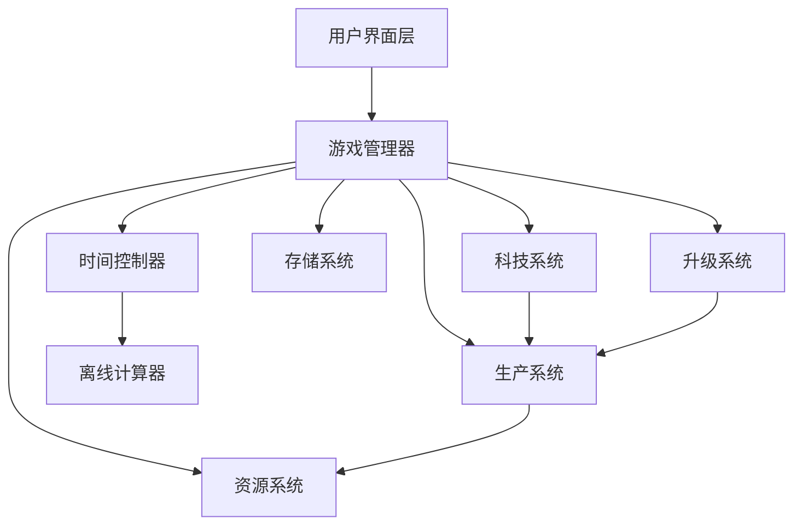

# 设计文档

## 概述

本设计文档描述了 Factorio 风格放置游戏的技术架构和实现方案。游戏采用基于 Web 的架构，使用 TypeScript/JavaScript 开发，支持本地存储和离线计算。核心设计理念是创建一个可扩展的生产系统，支持复杂的资源流动和自动化机制。

## 架构

### 整体架构



### 核心模块

1. **游戏管理器 (GameManager)**: 协调所有子系统，管理游戏状态
2. **资源系统 (ResourceSystem)**: 管理所有资源的存储和流动
3. **生产系统 (ProductionSystem)**: 处理所有生产设施的逻辑
4. **科技系统 (TechnologySystem)**: 管理科技树和解锁机制
5. **时间控制器 (TimeController)**: 处理游戏时间和离线计算
6. **存储系统 (StorageSystem)**: 处理数据持久化

## 组件和接口

### 资源系统

```typescript
interface Resource {
  id: string;
  name: string;
  amount: number;
  maxAmount: number;
  productionRate: number; // 每秒生产量
}

interface ResourceManager {
  resources: Map<string, Resource>;
  addResource(resourceId: string, amount: number): boolean;
  consumeResource(resourceId: string, amount: number): boolean;
  getResource(resourceId: string): Resource | null;
  updateProduction(deltaTime: number): void;
}
```

### 生产系统

```typescript
interface ProductionFacility {
  id: string;
  type: string;
  level: number;
  isActive: boolean;
  inputResources: ResourceRequirement[];
  outputResources: ResourceOutput[];
  productionTime: number; // 生产周期（秒）
  efficiency: number; // 效率倍数
}

interface ProductionChain {
  facilities: ProductionFacility[];
  calculateThroughput(): number;
  updateProduction(deltaTime: number): void;
  checkBottlenecks(): string[];
}
```

### 科技系统

```typescript
interface Technology {
  id: string;
  name: string;
  description: string;
  cost: ResourceRequirement[];
  prerequisites: string[];
  unlocks: string[]; // 解锁的建筑或功能
  isResearched: boolean;
  researchProgress: number;
}

interface TechnologyTree {
  technologies: Map<string, Technology>;
  researchTechnology(techId: string): boolean;
  getAvailableTechnologies(): Technology[];
  checkPrerequisites(techId: string): boolean;
}
```

### 时间和离线系统

```typescript
interface TimeController {
  currentTime: number;
  lastSaveTime: number;
  gameSpeed: number;
  calculateOfflineProgress(offlineTime: number): OfflineResult;
  update(deltaTime: number): void;
}

interface OfflineResult {
  resourcesGained: Map<string, number>;
  facilitiesBuilt: number;
  technologiesResearched: string[];
  maxOfflineHours: number;
}
```

## 数据模型

### 游戏状态

```typescript
interface GameState {
  version: string;
  playerId: string;
  resources: Map<string, Resource>;
  facilities: ProductionFacility[];
  technologies: Map<string, Technology>;
  gameTime: number;
  lastSaveTime: number;
  settings: GameSettings;
  language: string; // 当前语言设置
}

interface GameSettings {
  autoSave: boolean;
  autoSaveInterval: number; // 秒
  maxOfflineHours: number;
  showNotifications: boolean;
}
```

### Factorio 数据结构适配

```typescript
// 完整的Factorio数据结构
interface FactorioData {
  version: {
    base: string;
    "elevated-rails": string;
    quality: string;
    "space-age": string;
  };
  categories: FactorioCategory[];
  icons: FactorioIcon[];
  items: FactorioItemUnion[];
  recipes: FactorioRecipe[];
  locations: FactorioLocation[];
  defaults: FactorioDefaults;
}

interface FactorioCategory {
  id: string;
  name: string;
  icon?: string;
}

interface FactorioIcon {
  id: string;
  position: string; // CSS background-position格式
  color?: string; // 主色调，用于UI着色
}

// 基础物品接口
interface FactorioItemBase {
  id: string;
  name: string;
  category: string;
  stack: number; // 堆叠数量
  row: number; // UI排序行
  flags?: string[]; // 如["locked"]表示需要解锁
  icon?: string; // 自定义图标（如果与id不同）
  iconText?: string; // 图标上显示的文本（如科技等级"2"、温度"500°"等）
}

// 普通物品（资源、中间产品等）
interface FactorioItem extends FactorioItemBase {
  category:
    | "logistics"
    | "production"
    | "intermediate-products"
    | "space"
    | "combat"
    | "fluids"
    | "other";
}

// 生产设施
interface FactorioMachine extends FactorioItemBase {
  category: "production";
  machine: {
    speed: number; // 生产速度倍数
    modules?: number; // 模块插槽数量
    type?: "electric" | "burner"; // 能源类型
    fuelCategories?: string[]; // 燃料类型
    usage?: number; // 功耗/燃料消耗
    drain?: number; // 待机功耗
    pollution?: number; // 污染产生
    size: [number, number]; // 建筑尺寸
    entityType?: string; // 实体类型
    locations?: string[]; // 可建造的星球
    disallowedEffects?: string[]; // 禁用的模块效果
    hideRate?: boolean; // 是否隐藏生产速率
  };
}

// 传送带
interface FactorioBelt extends FactorioItemBase {
  category: "logistics";
  belt: {
    speed: number; // 传送速度
  };
}

// 信标
interface FactorioBeacon extends FactorioItemBase {
  category: "production";
  beacon: {
    effectivity: number; // 效果倍数
    modules: number; // 模块插槽数量
    range: number; // 影响范围
    type: "electric"; // 能源类型
    usage: number; // 功耗
    disallowedEffects?: string[]; // 禁用的模块效果
    size: [number, number]; // 建筑尺寸
  };
}

// 模块
interface FactorioModule extends FactorioItemBase {
  category: "production";
  module: {
    consumption?: number; // 功耗影响（正数增加，负数减少）
    speed?: number; // 速度影响
    productivity?: number; // 产能影响
    quality?: number; // 品质影响
    pollution?: number; // 污染影响
  };
}

// 燃料
interface FactorioFuel extends FactorioItemBase {
  fuel: {
    category: string; // 燃料类型（chemical, nuclear, nutrients, food, fluid等）
    value: number; // 燃料值（能量单位）
  };
}

// 科技
interface FactorioTechnology extends FactorioItemBase {
  category: "technology";
  technology: {
    prerequisites?: string[]; // 前置科技
    unlockedRecipes?: string[]; // 解锁的配方
    prodUpgrades?: string[]; // 生产力升级影响的配方列表
  };
}

// 联合类型，表示所有可能的物品类型
type FactorioItemUnion =
  | FactorioItem
  | FactorioMachine
  | FactorioBelt
  | FactorioBeacon
  | FactorioModule
  | FactorioFuel
  | FactorioTechnology;

interface FactorioRecipe {
  id: string;
  name: string;
  category: string;
  row: number;
  time: number; // 生产时间（秒）
  producers: string[]; // 可生产的机器列表
  in: Record<string, number>; // 输入资源
  out: Record<string, number>; // 输出资源
  flags?: string[]; // 如["locked"]
  disallowedEffects?: string[]; // 禁用的模块效果
  icon?: string; // 自定义图标（如果与id不同）
  iconText?: string; // 图标上显示的文本（如科技等级等）
}

// 注意：FactorioTechnology现在已经在上面的联合类型中定义

interface FactorioLocation {
  id: string;
  name: string;
  icon?: string;
}

interface FactorioDefaults {
  beacon: string;
  belt: string;
  fuelRank: string[];
  cargoWagon: string;
  fluidWagon: string;
  excludedRecipes: string[];
  pipe: string;
  presets: FactorioPreset[];
}

interface FactorioPreset {
  id: number;
  label: string;
  belt: string;
  beltStack?: number;
  machineRank: string[];
  moduleRank?: string[];
  beacon?: string;
  beaconCount?: number;
  beaconModule?: string;
}

// 品质系统支持（基于hash.json中的(1)(2)(3)(5)后缀）
interface QualityItem extends FactorioItem {
  quality: 1 | 2 | 3 | 5; // 普通、优秀、稀有、史诗、传奇
  baseId: string; // 基础物品ID（去除品质后缀）
}
```

### 图标和本地化系统

```typescript
// 图标精灵图系统
interface IconSystem {
  spriteUrl: string; // icons.webp的URL
  iconSize: number; // 单个图标尺寸（66px）
  getIconStyle(id: string): {
    // 获取图标CSS样式
    backgroundImage: string;
    backgroundPosition: string;
    width: string;
    height: string;
  };
}

// 多语言本地化数据
interface LocalizationData {
  categories: Record<string, string>; // 分类名称
  items: Record<string, string>; // 物品名称
  recipes: Record<string, string>; // 配方名称
  technologies?: Record<string, string>; // 科技名称（部分语言可能没有）
}

// 本地化管理器
interface LocalizationManager {
  currentLanguage: string;
  availableLanguages: string[];
  data: Record<string, LocalizationData>;

  setLanguage(lang: string): void;
  translate(key: string, type: "items" | "recipes" | "categories"): string;
  getLocalizedName(item: FactorioItem): string;
}
```

### 数据处理和适配层

```typescript
// 数据加载和处理器
interface FactorioDataProcessor {
  loadData(): Promise<FactorioData>;
  loadLocalization(language: string): Promise<LocalizationData>;

  // 数据转换方法
  convertToGameItems(factorioItems: FactorioItemUnion[]): GameItem[];
  convertToGameRecipes(factorioRecipes: FactorioRecipe[]): GameRecipe[];
  convertToGameTechnologies(
    factorioTechnologies: FactorioTechnology[]
  ): GameTechnology[];

  // 类型过滤方法
  filterMachines(items: FactorioItemUnion[]): FactorioMachine[];
  filterTechnologies(items: FactorioItemUnion[]): FactorioTechnology[];
  filterModules(items: FactorioItemUnion[]): FactorioModule[];
  filterBeacons(items: FactorioItemUnion[]): FactorioBeacon[];

  // 品质系统处理
  parseQualityItems(hashData: { items: string[] }): QualityItem[];
  getBaseItemId(qualityItemId: string): string;
  getQualityLevel(qualityItemId: string): number;

  // 生产链分析
  buildProductionChains(): ProductionChainMap;
  findProducers(itemId: string): FactorioMachine[];
  findConsumers(itemId: string): FactorioRecipe[];

  // 类型检查辅助方法
  isMachine(item: FactorioItemUnion): item is FactorioMachine;
  isTechnology(item: FactorioItemUnion): item is FactorioTechnology;
  isModule(item: FactorioItemUnion): item is FactorioModule;
  isBeacon(item: FactorioItemUnion): item is FactorioBeacon;
}

// 游戏数据适配
interface GameItem {
  id: string;
  name: string;
  localizedName: string;
  category: string;
  stackSize: number;
  iconId: string;
  quality: number;
  isLocked: boolean;

  // 生产设施属性
  productionSpeed?: number;
  powerConsumption?: number;
  moduleSlots?: number;
  allowedEffects?: string[];
  buildingSize?: [number, number];
  availableLocations?: string[];
}

interface GameRecipe {
  id: string;
  name: string;
  localizedName: string;
  category: string;
  productionTime: number;
  inputs: ResourceRequirement[];
  outputs: ResourceOutput[];
  producers: string[];
  isLocked: boolean;
  allowedEffects?: string[];
}

interface GameTechnology {
  id: string;
  name: string;
  localizedName: string;
  prerequisites: string[];
  unlockedRecipes: string[];
  unlockedItems: string[];
  researchCost?: ResourceRequirement[]; // 需要从其他数据源获取
  isResearched: boolean;
}
```

## 错误处理

### 错误类型

1. **资源不足错误**: 当尝试消耗不存在的资源时
2. **设施状态错误**: 当设施处于无效状态时
3. **存储错误**: 当本地存储失败时
4. **配置错误**: 当游戏配置数据无效时

### 错误处理策略

```typescript
class GameError extends Error {
  constructor(message: string, public code: string, public context?: any) {
    super(message);
  }
}

interface ErrorHandler {
  handleResourceError(error: GameError): void;
  handleProductionError(error: GameError): void;
  handleStorageError(error: GameError): void;
  logError(error: GameError): void;
}
```

### 恢复机制

- 自动保存机制防止数据丢失
- 状态验证确保游戏数据一致性
- 降级模式在出现错误时保持基本功能
- 错误日志记录便于调试

## 测试策略

### 单元测试

1. **资源系统测试**

   - 资源添加和消耗逻辑
   - 生产速率计算
   - 库存上限处理

2. **生产系统测试**

   - 设施生产逻辑
   - 生产链计算
   - 瓶颈检测算法

3. **离线计算测试**
   - 不同离线时长的计算准确性
   - 资源上限约束
   - 生产链平衡

### 集成测试

1. **完整游戏循环测试**

   - 从开始到中期游戏的完整流程
   - 科技解锁和设施建造的集成
   - 离线-在线切换的数据一致性

2. **性能测试**
   - 大量设施时的性能表现
   - 长时间离线计算的效率
   - 内存使用优化

### 用户体验测试

1. **平衡性测试**

   - 游戏进度曲线的合理性
   - 资源获取和消耗的平衡
   - 科技解锁节奏

2. **界面可用性测试**
   - 关键信息的可见性
   - 操作流程的直观性
   - 移动设备适配

## 性能考虑

### 优化策略

1. **计算优化**

   - 使用增量计算减少重复运算
   - 批量处理资源更新
   - 智能的离线计算算法

2. **内存管理**

   - 对象池复用减少 GC 压力
   - 延迟加载非关键数据
   - 定期清理无用状态

3. **存储优化**
   - 压缩存储格式
   - 增量保存机制
   - 异步存储操作

### 扩展性设计

- 模块化架构支持功能扩展
- 配置驱动的内容系统
- 插件式的生产设施设计
- 可扩展的科技树结构

## 初始资源获取机制

### 🌳 木材获取策略

基于Factorio数据分析，游戏初始阶段的木材获取机制：

#### **初始阶段：手动采集**
```typescript
interface ManualHarvesting {
  resourceType: "wood";
  method: "click-to-collect";
  initialAmount: 50; // 游戏开始时的初始木材
  mapTrees: number; // 地图上可采集的树木数量
  harvestRate: 1; // 每次点击获得的木材数量
}
```

#### **自动化阶段：科技解锁后的循环生产**
```typescript
interface WoodProductionCycle {
  woodProcessing: {
    input: { wood: 2 };
    output: { "tree-seed": 1 };
    requiredTech: "tree-seeding";
    producers: ["biochamber", "assembling-machine-2", "assembling-machine-3"];
  };
  treePlanting: {
    input: { "tree-seed": 46 };
    output: { wood: 184 };
    time: 600; // 10分钟
    facility: "agricultural-tower";
    locations: ["nauvis"];
  };
}
```

#### **游戏开始资源配置**
```typescript
interface InitialResources {
  wood: 50;        // 用于制作木箱等早期物品
  stone: 20;       // 用于熔炉和基础建筑
  ironOre: 0;      // 通过采矿机获取
  copperOre: 0;    // 通过采矿机获取
  coal: 0;         // 通过采矿机获取，重要燃料
}
```

#### **资源获取优先级**
1. **木材**: 手动采集 → 科技解锁后循环生产
2. **矿物**: 建造采矿机进行自动化开采
3. **燃料**: 煤炭（采矿）→ 木材（备用燃料，能量值2）
4. **高级资源**: 通过生产链逐步解锁

这个机制确保了游戏的渐进式发展，从手动操作逐步过渡到自动化生产。

## Idle游戏UI架构设计

### 🎮 **整体布局**

```typescript
interface IdleGameUI {
  topBar: CategoryBar;      // 顶部分类栏
  leftPanel: ItemList;      // 左侧物品列表
  rightPanel: ItemDetail;   // 右侧物品详情
}
```

### 📊 **顶部分类栏**

```typescript
interface CategoryBar {
  categories: FactorioCategory[];
  activeCategory: string;
  onCategorySelect: (categoryId: string) => void;
}

interface CategoryTab {
  id: string;
  name: string;
  localizedName: string;
  icon?: string;
  itemCount: number;        // 该分类下的物品数量
  unlockedCount: number;    // 已解锁的物品数量
}
```

### 📋 **左侧物品列表**

```typescript
interface ItemList {
  items: ItemListEntry[];
  searchFilter: string;
  sortBy: 'name' | 'quantity' | 'productionRate';
  showOnlyUnlocked: boolean;
}

interface ItemListEntry {
  item: FactorioItemUnion;
  currentQuantity: number;
  maxQuantity: number;
  productionRate: number;    // 每秒生产/消耗速率
  isUnlocked: boolean;
  isProducing: boolean;
  hasAutomation: boolean;    // 是否配置了自动化
  onClick: () => void;
}
```

### 🔍 **右侧物品详情面板**

```typescript
interface ItemDetail {
  selectedItem: FactorioItemUnion | null;
  tabs: DetailTab[];
  activeTab: string;
}

interface DetailTab {
  id: 'info' | 'manual' | 'automation' | 'storage';
  name: string;
  component: React.Component;
}
```

#### **信息标签页**
```typescript
interface InfoTab {
  item: FactorioItemUnion;
  description: string;
  category: string;
  stackSize: number;
  currentQuantity: number;
  maxQuantity: number;
  productionRate: number;
  consumptionRate: number;
  usedInRecipes: string[];   // 用于哪些配方
  producedByRecipes: string[]; // 由哪些配方生产
}
```

#### **手动操作标签页**
```typescript
interface ManualTab {
  item: FactorioItemUnion;
  canHarvest: boolean;       // 是否可以手动采集
  canCraft: boolean;         // 是否可以手动合成
  harvestButton: {
    enabled: boolean;
    cooldown: number;        // 冷却时间（毫秒）
    amount: number;          // 每次获得数量
    onClick: () => void;
  };
  craftButton: {
    enabled: boolean;
    recipe: FactorioRecipe;
    requiredResources: ResourceRequirement[];
    canAfford: boolean;
    onClick: () => void;
  };
}
```

#### **自动化配置标签页**
```typescript
interface AutomationTab {
  item: FactorioItemUnion;
  availableFacilities: FactorioMachine[];
  currentFacility: FactorioMachine | null;
  facilityLevel: number;
  maxLevel: number;
  efficiency: number;        // 当前效率百分比
  upgradeOptions: {
    nextLevel: number;
    cost: ResourceRequirement[];
    canAfford: boolean;
    efficiencyGain: number;
  };
  moduleSlots: ModuleSlot[];
  beaconConfig: BeaconConfiguration;
}

interface ModuleSlot {
  id: number;
  module: FactorioModule | null;
  availableModules: FactorioModule[];
  onModuleChange: (module: FactorioModule) => void;
}
```

#### **存储配置标签页**
```typescript
interface StorageTab {
  item: FactorioItemUnion;
  currentCapacity: number;
  maxCapacity: number;
  storageUpgrades: StorageUpgrade[];
  selectedUpgrade: StorageUpgrade | null;
}

interface StorageUpgrade {
  id: string;
  name: string;
  capacityIncrease: number;
  cost: ResourceRequirement[];
  canAfford: boolean;
  onPurchase: () => void;
}
```

### 🎯 **交互流程**

1. **分类浏览**: 玩家点击顶部分类 → 左侧显示该分类物品
2. **物品选择**: 玩家点击左侧物品 → 右侧显示详情面板
3. **手动操作**: 在详情面板中点击采集/合成按钮
4. **自动化配置**: 选择生产设备、升级等级、配置模块
5. **存储管理**: 购买存储升级，提高物品上限

### 🎨 **视觉设计原则**

- **信息密度**: 在有限空间内展示最重要的信息
- **状态指示**: 清晰的视觉反馈显示生产状态
- **进度可视化**: 进度条显示生产进度和冷却时间
- **分层信息**: 重要信息突出显示，次要信息折叠
- **响应式设计**: 适配不同屏幕尺寸