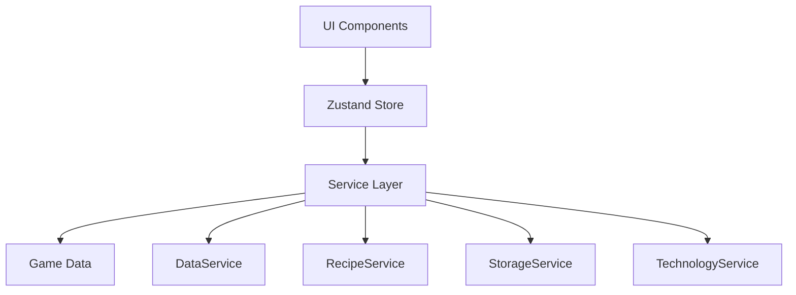

# 异星工厂 v2 (Idle Factorio)

<p align="center">
  
  
  
  
</p>

<p align="center">
  一个基于 React 的放置类工厂管理游戏，灵感来源于 Factorio
</p>

<p align="center">
  <a href="https://emeiziying.github.io/Idle-Factorio/">🎮 在线试玩</a> •
  <a href="#-快速开始">快速开始</a> •
  <a href="./ROADMAP.md">开发路线图</a> •
  <a href="https://github.com/emeiziying/Idle-Factorio/issues">报告问题</a>
</p>

## 📋 项目概述

**异星工厂 v2** 是一个现代化的网页游戏，实现了工厂生产管理的核心机制。玩家可以管理资源、配方、科技树，建立自动化生产链，体验工厂扩张的乐趣。

### ✨ 特色功能

- 🏭 **自动化生产** - 设置生产链，自动制造物品
- 🔬 **科技研究** - 解锁新配方和生产能力
- 📊 **配方优化** - 智能分析最优生产路径
- 💾 **云端存档** - 自动保存游戏进度（支持压缩）
- 📱 **移动端适配** - 完美支持触屏操作
- 🌏 **多语言支持** - 中文、日文界面

### 🛠️ 技术栈

| 技术 | 版本 | 说明 |
|------|------|------|
| React | 19.1.0 | 前端框架 |
| TypeScript | 5.8.3 | 类型安全 |
| Vite | 7.0.4 | 构建工具 |
| Material-UI | 7.2.0 | UI 组件库 |
| Zustand | 5.0.6 | 状态管理 |
| pnpm | 9.15.0 | 包管理器 |

## 🚀 快速开始

### 环境要求

- Node.js >= 18.0.0
- pnpm >= 9.15.0

### 安装步骤

1. **克隆仓库**
   ```bash
   git clone https://github.com/emeiziying/Idle-Factorio.git
   cd Idle-Factorio
   ```

2. **安装依赖**
   ```bash
   pnpm install
   ```

3. **启动开发服务器**
   ```bash
   pnpm dev
   ```
   
   访问 `http://localhost:5173` 开始游戏！

### 其他命令

```bash
# 构建生产版本
pnpm build

# 预览生产构建
pnpm preview

# 运行代码检查
pnpm lint
```

## 🏗️ 项目架构

### 目录结构

```
idle-factorio/
├── src/
│   ├── components/        # React 组件
│   ├── hooks/            # 自定义 React Hooks
│   ├── services/         # 业务逻辑服务层
│   ├── store/            # Zustand 状态管理
│   ├── data/             # 游戏数据定义
│   ├── types/            # TypeScript 类型定义
│   ├── utils/            # 工具函数
│   └── theme/            # 主题配置
├── public/
│   └── data/             # 游戏静态数据文件
├── docs/                 # 项目文档
└── .github/              # GitHub 相关配置
```

### 核心架构



### 已实现模块

| 模块 | 状态 | 描述 |
|------|------|------|
| 生产系统 | ✅ 完成 | 物品制作、队列管理、库存系统 |
| 配方系统 | ✅ 完成 | 配方分析、效率计算、依赖链 |
| 存储系统 | ✅ 完成 | 固体/液体存储、容量管理 |
| 存档系统 | ✅ 完成 | 自动保存、LZ-String 压缩 |
| 设施系统 | 🚧 开发中 | 基础框架已完成 |
| 科技系统 | 📋 计划中 | 科技树、研究进度 |
| 电力系统 | 📋 计划中 | 发电、配电网络 |

## 🎮 游戏玩法

### 基础流程

1. **手动制作** - 从基础材料开始手动制作物品
2. **建造设施** - 使用资源建造自动化生产设施
3. **研究科技** - 解锁新的配方和生产方式
4. **扩展工厂** - 优化生产链，提高效率
5. **自动化生产** - 实现全自动化的工厂运作

### 游戏界面

- **生产标签** - 查看和制作各类物品
- **设施标签** - 管理自动化生产设施
- **科技标签** - 研究新技术
- **统计标签** - 查看生产数据和效率
- **设置标签** - 游戏设置和存档管理

## 🛠️ 开发指南

### 开发流程

1. **定义类型** - 在 `src/types/` 中定义 TypeScript 接口
2. **实现服务** - 在 `src/services/` 中编写业务逻辑
3. **管理状态** - 在 `src/store/` 中处理状态变更
4. **创建组件** - 在 `src/components/` 中实现 UI

### 代码规范

- 使用 TypeScript 严格模式
- 遵循 ESLint 配置规则
- 组件使用函数式写法
- 服务使用单例/静态类模式
- 提交前运行 `pnpm lint`

### 性能优化建议

- 大列表使用虚拟滚动
- 组件适当使用 `React.memo`
- 状态更新注意批处理
- 复杂计算考虑 Web Worker

## 📚 相关文档

- [更新日志](./CHANGELOG.md) - 版本更新历史
- [开发路线图](./ROADMAP.md) - 未来版本规划
- [贡献指南](./CONTRIBUTING.md) - 如何参与开发
- [API 文档](./docs/api.md) - 服务层 API 说明

## 🤝 贡献指南

我们欢迎所有形式的贡献！无论是新功能、bug 修复还是文档改进。

### 贡献步骤

1. Fork 本仓库
2. 创建特性分支 (`git checkout -b feature/AmazingFeature`)
3. 提交更改 (`git commit -m 'Add: 新增某某功能'`)
4. 推送到分支 (`git push origin feature/AmazingFeature`)
5. 提交 Pull Request

### 提交规范

- `Add:` 新增功能
- `Fix:` 修复 bug
- `Update:` 更新功能
- `Docs:` 文档更新
- `Style:` 代码格式调整
- `Refactor:` 代码重构

## 📄 许可证

本项目基于 [MIT 许可证](./LICENSE) 开源。

## 🙏 致谢

- [Factorio](https://factorio.com/) - 游戏灵感来源
- [React](https://react.dev/) - 前端框架
- [Material-UI](https://mui.com/) - UI 组件库
- 所有贡献者和玩家

---

<p align="center">
  Made with ❤️ by <a href="https://github.com/emeiziying">emeiziying</a>
</p>

<p align="center">
  <a href="#异星工厂-v2-idle-factorio">回到顶部 ↑</a>
</p>
