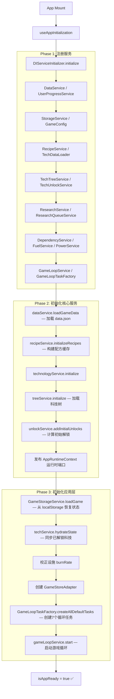
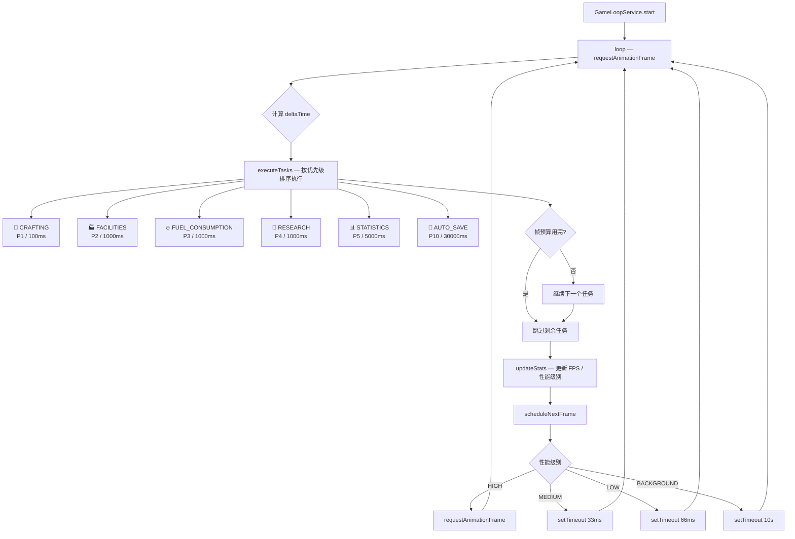
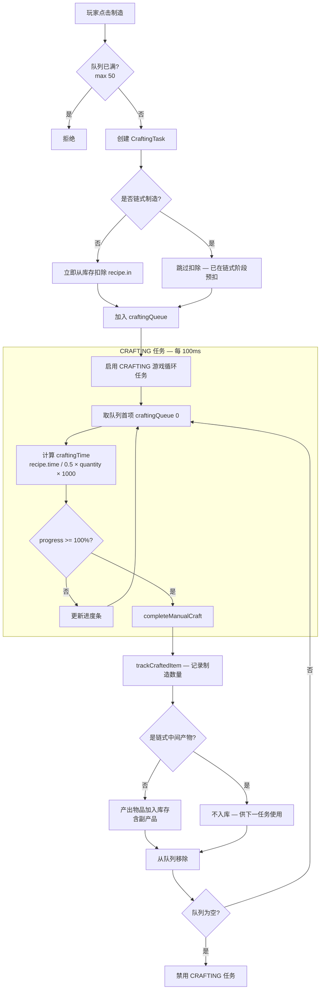
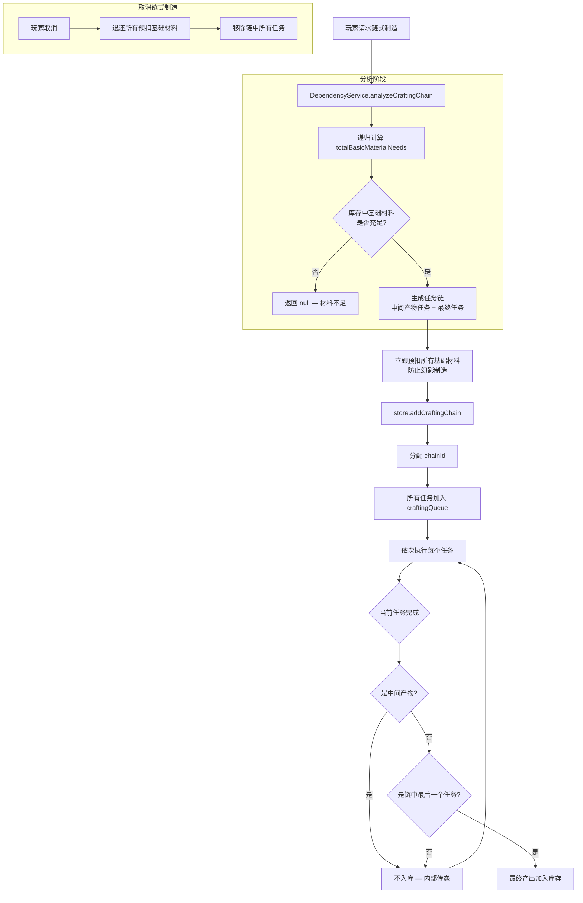
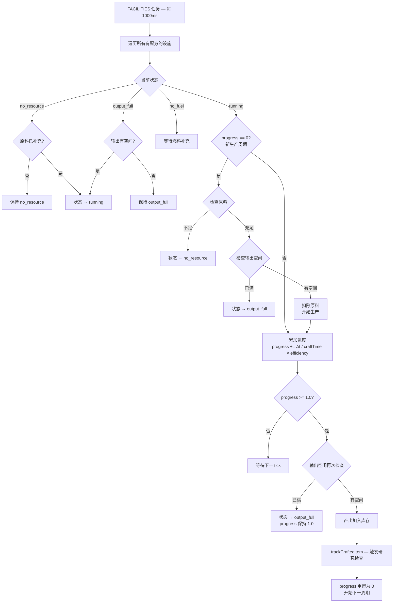
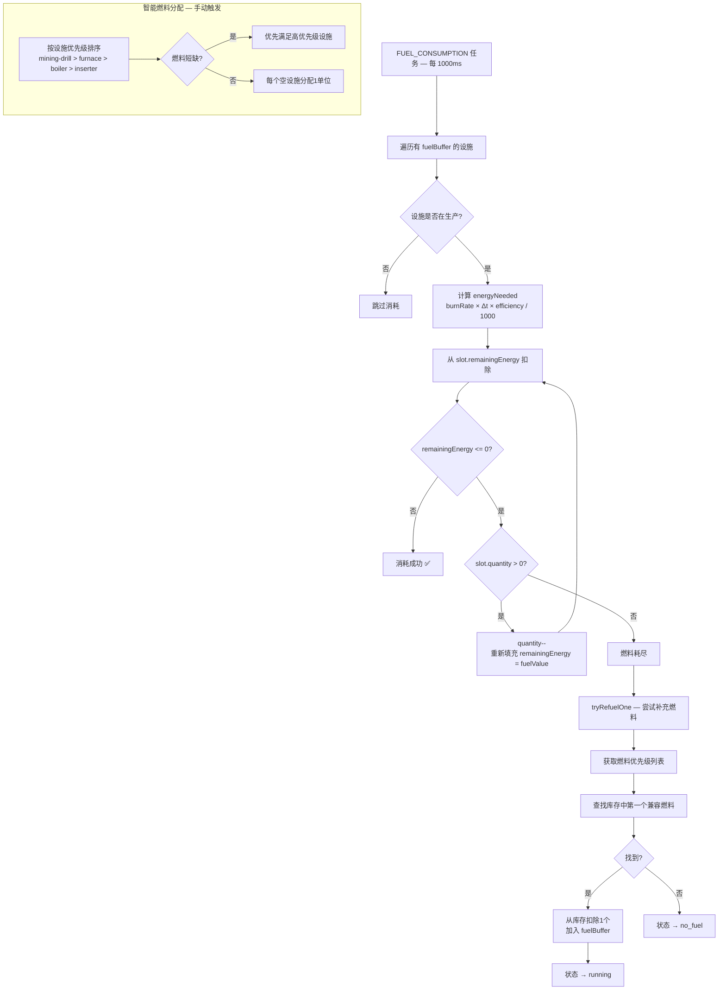
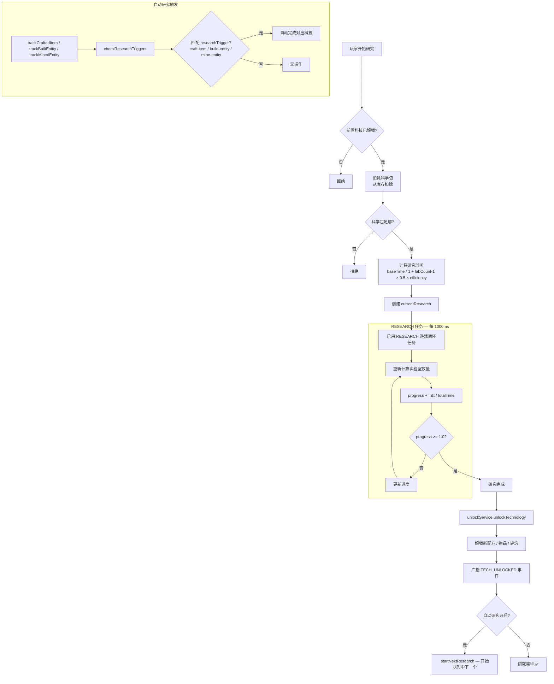
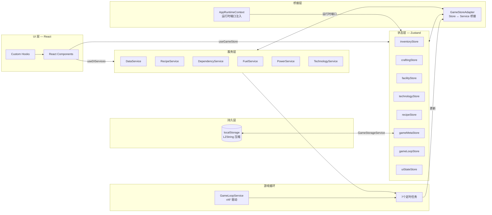
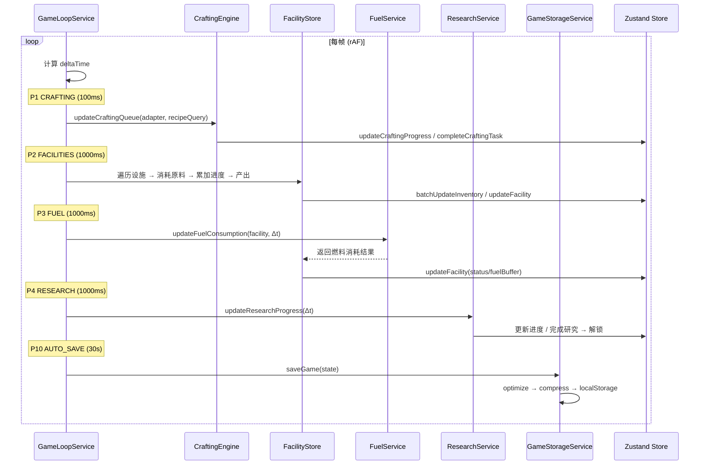

# Idle Factorio - 游戏逻辑流程图

## 1. 应用初始化流程

```mermaid
flowchart TD
    A[App Mount] --> B[useAppInitialization]
    B --> C[DIServiceInitializer.initialize]

    subgraph Phase1["Phase 1: 注册服务"]
        C --> D1[DataService / UserProgressService]
        D1 --> D2[StorageService / GameConfig]
        D2 --> D3[RecipeService / TechDataLoader]
        D3 --> D4[TechTreeService / TechUnlockService]
        D4 --> D5[ResearchService / ResearchQueueService]
        D5 --> D6[DependencyService / FuelService / PowerService]
        D6 --> D7[GameLoopService / GameLoopTaskFactory]
    end

    subgraph Phase2["Phase 2: 初始化核心服务"]
        D7 --> E1[dataService.loadGameData — 加载 data.json]
        E1 --> E2[recipeService.initializeRecipes — 构建配方缓存]
        E2 --> E3[technologyService.initialize]
        E3 --> E3a[treeService.initialize — 加载科技树]
        E3a --> E3b[unlockService.addInitialUnlocks — 计算初始解锁]
        E3b --> E4[发布 AppRuntimeContext 运行时端口]
    end

    subgraph Phase3["Phase 3: 初始化应用层"]
        E4 --> F1[GameStorageService.loadGame — 从 localStorage 恢复状态]
        F1 --> F2[techService.hydrateState — 同步已解锁科技]
        F2 --> F3[校正设施 burnRate]
        F3 --> F4[创建 GameStoreAdapter]
        F4 --> F5[GameLoopTaskFactory.createAllDefaultTasks — 创建7个循环任务]
        F5 --> F6[gameLoopService.start — 启动游戏循环]
    end

    F6 --> G[isAppReady = true ✅]
```

## 2. 游戏主循环

```mermaid
flowchart TD
    A[GameLoopService.start] --> B[loop — requestAnimationFrame]
    B --> C{计算 deltaTime}
    C --> D[executeTasks — 按优先级排序执行]

    D --> T1["🔨 CRAFTING<br/>P1 / 100ms"]
    D --> T2["🏭 FACILITIES<br/>P2 / 1000ms"]
    D --> T3["🔥 FUEL_CONSUMPTION<br/>P3 / 1000ms"]
    D --> T4["🔬 RESEARCH<br/>P4 / 1000ms"]
    D --> T5["📊 STATISTICS<br/>P5 / 5000ms"]
    D --> T6["💾 AUTO_SAVE<br/>P10 / 30000ms"]

    D --> E{帧预算用完?}
    E -- 否 --> F[继续下一个任务]
    E -- 是 --> G[跳过剩余任务]
    F --> G
    G --> H[updateStats — 更新 FPS / 性能级别]
    H --> I[scheduleNextFrame]

    I --> I1{性能级别}
    I1 -- HIGH --> I2[requestAnimationFrame]
    I1 -- MEDIUM --> I3[setTimeout 33ms]
    I1 -- LOW --> I4[setTimeout 66ms]
    I1 -- BACKGROUND --> I5[setTimeout 10s]
    I2 & I3 & I4 & I5 --> B
```

## 3. 手工制造流程

```mermaid
flowchart TD
    A[玩家点击制造] --> B{队列已满?<br/>max 50}
    B -- 是 --> B1[拒绝]
    B -- 否 --> C[创建 CraftingTask]
    C --> D{是否链式制造?}
    D -- 否 --> E[立即从库存扣除 recipe.in]
    D -- 是 --> F[跳过扣除 — 已在链式阶段预扣]
    E & F --> G[加入 craftingQueue]
    G --> H[启用 CRAFTING 游戏循环任务]

    subgraph loop["CRAFTING 任务 — 每 100ms"]
        H --> I[取队列首项 craftingQueue 0]
        I --> J[计算 craftingTime<br/>recipe.time / 0.5 × quantity × 1000]
        J --> K{progress >= 100%?}
        K -- 否 --> L[更新进度条]
        L --> I
        K -- 是 --> M[completeManualCraft]
    end

    M --> N[trackCraftedItem — 记录制造数量]
    N --> O{是链式中间产物?}
    O -- 否 --> P[产出物品加入库存<br/>含副产品]
    O -- 是 --> Q[不入库 — 供下一任务使用]
    P & Q --> R[从队列移除]
    R --> S{队列为空?}
    S -- 是 --> T[禁用 CRAFTING 任务]
    S -- 否 --> I
```

## 4. 链式制造流程

```mermaid
flowchart TD
    A[玩家请求链式制造] --> B[DependencyService.analyzeCraftingChain]

    subgraph analysis["分析阶段"]
        B --> C[递归计算 totalBasicMaterialNeeds]
        C --> D{库存中基础材料<br/>是否充足?}
        D -- 否 --> E[返回 null — 材料不足]
        D -- 是 --> F[生成任务链<br/>中间产物任务 + 最终任务]
    end

    F --> G["立即预扣所有基础材料<br/>防止幻影制造"]
    G --> H[store.addCraftingChain]
    H --> I[分配 chainId]
    I --> J[所有任务加入 craftingQueue]
    J --> K[依次执行每个任务]

    K --> L{当前任务完成}
    L --> M{是中间产物?}
    M -- 是 --> N[不入库 — 内部传递]
    M -- 否 --> O{是链中最后一个任务?}
    O -- 是 --> P[最终产出加入库存]
    O -- 否 --> N
    N --> K

    subgraph cancel["取消链式制造"]
        Q[玩家取消] --> R[退还所有预扣基础材料]
        R --> S[移除链中所有任务]
    end
```

## 5. 设施生产流程

```mermaid
flowchart TD
    A[FACILITIES 任务 — 每 1000ms] --> B[遍历所有有配方的设施]

    B --> C{当前状态}

    C -- no_resource --> D{原料已补充?}
    D -- 否 --> Z1[保持 no_resource]
    D -- 是 --> E1[状态 → running]

    C -- output_full --> F{输出有空间?}
    F -- 否 --> Z2[保持 output_full]
    F -- 是 --> E1

    C -- no_fuel --> Z3[等待燃料补充]

    C -- running --> G{progress == 0?<br/>新生产周期}
    G -- 是 --> H{检查原料}
    H -- 不足 --> I[状态 → no_resource]
    H -- 充足 --> J{检查输出空间}
    J -- 已满 --> K[状态 → output_full]
    J -- 有空间 --> L[扣除原料<br/>开始生产]

    G -- 否 --> M[累加进度<br/>progress += Δt / craftTime × efficiency]

    L --> M
    M --> N{progress >= 1.0?}
    N -- 否 --> Z4[等待下一 tick]
    N -- 是 --> O{输出空间再次检查}
    O -- 已满 --> P[状态 → output_full<br/>progress 保持 1.0]
    O -- 有空间 --> Q[产出加入库存]
    Q --> R[trackCraftedItem — 触发研究检查]
    R --> S[progress 重置为 0<br/>开始下一周期]
```

## 6. 燃料系统流程

```mermaid
flowchart TD
    A[FUEL_CONSUMPTION 任务 — 每 1000ms] --> B[遍历有 fuelBuffer 的设施]

    B --> C{设施是否在生产?}
    C -- 否 --> D[跳过消耗]
    C -- 是 --> E[计算 energyNeeded<br/>burnRate × Δt × efficiency / 1000]

    E --> F[从 slot.remainingEnergy 扣除]
    F --> G{remainingEnergy <= 0?}
    G -- 否 --> H[消耗成功 ✅]
    G -- 是 --> I{slot.quantity > 0?}
    I -- 是 --> J[quantity--<br/>重新填充 remainingEnergy = fuelValue]
    J --> F
    I -- 否 --> K[燃料耗尽]

    K --> L[tryRefuelOne — 尝试补充燃料]
    L --> M[获取燃料优先级列表]
    M --> N[查找库存中第一个兼容燃料]
    N --> O{找到?}
    O -- 是 --> P[从库存扣除1个<br/>加入 fuelBuffer]
    P --> Q[状态 → running]
    O -- 否 --> R[状态 → no_fuel]

    subgraph smart["智能燃料分配 — 手动触发"]
        S1[按设施优先级排序<br/>mining-drill > furnace > boiler > inserter]
        S1 --> S2{燃料短缺?}
        S2 -- 是 --> S3[优先满足高优先级设施]
        S2 -- 否 --> S4[每个空设施分配1单位]
    end
```

## 7. 科技研究流程

```mermaid
flowchart TD
    A[玩家开始研究] --> B{前置科技已解锁?}
    B -- 否 --> B1[拒绝]
    B -- 是 --> C[消耗科学包<br/>从库存扣除]
    C --> D{科学包足够?}
    D -- 否 --> D1[拒绝]
    D -- 是 --> E[计算研究时间<br/>baseTime / 1 + labCount-1 × 0.5 × efficiency]
    E --> F[创建 currentResearch]
    F --> G[启用 RESEARCH 游戏循环任务]

    subgraph loop["RESEARCH 任务 — 每 1000ms"]
        G --> H[重新计算实验室数量]
        H --> I[progress += Δt / totalTime]
        I --> J{progress >= 1.0?}
        J -- 否 --> K[更新进度]
        K --> H
    end

    J -- 是 --> L[研究完成]
    L --> M[unlockService.unlockTechnology]
    M --> N[解锁新配方 / 物品 / 建筑]
    N --> O[广播 TECH_UNLOCKED 事件]
    O --> P{自动研究开启?}
    P -- 是 --> Q[startNextResearch — 开始队列中下一个]
    P -- 否 --> R[研究完毕 ✅]

    subgraph trigger["自动研究触发"]
        T1[trackCraftedItem / trackBuiltEntity / trackMinedEntity]
        T1 --> T2[checkResearchTriggers]
        T2 --> T3{匹配 researchTrigger?<br/>craft-item / build-entity / mine-entity}
        T3 -- 是 --> T4[自动完成对应科技]
        T3 -- 否 --> T5[无操作]
    end
```

## 8. 存档系统流程

```mermaid
flowchart TD
    subgraph save["保存流程"]
        A1[AUTO_SAVE 任务 — 每 30s] --> A2[adapter.saveGame]
        A3[手动保存] --> A4[forceSaveGame — 跳过防抖]
        A5[beforeunload 事件] --> A6[flushPendingSave — 同步保存]
        A2 --> B[store.saveGame — 防抖 2000ms]
        A4 --> C[executeSave]
        A6 --> C
        B --> C

        C --> D[optimizeState — 精简状态]
        D --> D1["inventory: Map → Record<id, amount>"]
        D --> D2["facilities → 精简字段"]
        D --> D3["stats → 紧凑数组格式"]
        D --> D4["research → techIds 数组"]
        D1 & D2 & D3 & D4 --> E[JSON.stringify]
        E --> F["LZString.compressToUTF16<br/>压缩 70-80%"]
        F --> G[localStorage.setItem]
    end

    subgraph load["加载流程"]
        H[loadGame] --> I[localStorage.getItem]
        I --> J{检测压缩格式}
        J -- LZString --> K[decompressFromUTF16]
        J -- 原始 --> L[直接解析]
        K & L --> M[JSON.parse]
        M --> N{格式检测}
        N -- 优化格式 --> O[restoreFromOptimized]
        N -- 旧格式 --> P[restoreFromLegacy]
        O --> Q["重建 Map/Set 类型<br/>恢复 stackSize / burnRate"]
        P --> Q
        Q --> R[hydrate 到 Zustand Store]
        R --> S[techService.hydrateState<br/>重建解锁状态]
    end
```

## 9. 总体数据流架构

```mermaid
flowchart LR
    subgraph storage["持久层"]
        LS[(localStorage<br/>LZString 压缩)]
    end

    subgraph store["状态层 — Zustand"]
        S1[inventoryStore]
        S2[craftingStore]
        S3[facilityStore]
        S4[technologyStore]
        S5[recipeStore]
        S6[gameMetaStore]
        S7[gameLoopStore]
        S8[uiStateStore]
    end

    subgraph adapter["桥接层"]
        GA[GameStoreAdapter<br/>Store ↔ Service 桥接]
        ARC[AppRuntimeContext<br/>运行时端口注入]
    end

    subgraph services["服务层"]
        DS[DataService]
        RS[RecipeService]
        DPS[DependencyService]
        FS[FuelService]
        PS[PowerService]
        TS[TechnologyService]
    end

    subgraph loop["游戏循环"]
        GLS[GameLoopService<br/>rAF 驱动]
        GLT[7个定时任务]
    end

    subgraph ui["UI 层 — React"]
        RC[React Components]
        HK[Custom Hooks]
    end

    LS <--> |GameStorageService| S6
    store <--> GA
    GA <--> services
    ARC --> |运行时端口| store
    services --> GLT
    GLS --> GLT
    GLT --> |更新| GA
    RC --> |useGameStore| store
    RC --> |useDIServices| services
    HK --> RC
```

## 10. 核心游戏循环时序图

```mermaid
sequenceDiagram
    participant GL as GameLoopService
    participant CE as CraftingEngine
    participant FS as FacilityStore
    participant FU as FuelService
    participant RS as ResearchService
    participant ST as GameStorageService
    participant Store as Zustand Store

    loop 每帧 (rAF)
        GL->>GL: 计算 deltaTime

        Note over GL: P1 CRAFTING (100ms)
        GL->>CE: updateCraftingQueue(adapter, recipeQuery)
        CE->>Store: updateCraftingProgress / completeCraftingTask

        Note over GL: P2 FACILITIES (1000ms)
        GL->>FS: 遍历设施 → 消耗原料 → 累加进度 → 产出
        FS->>Store: batchUpdateInventory / updateFacility

        Note over GL: P3 FUEL (1000ms)
        GL->>FU: updateFuelConsumption(facility, Δt)
        FU-->>FS: 返回燃料消耗结果
        FS->>Store: updateFacility(status/fuelBuffer)

        Note over GL: P4 RESEARCH (1000ms)
        GL->>RS: updateResearchProgress(Δt)
        RS->>Store: 更新进度 / 完成研究 → 解锁

        Note over GL: P10 AUTO_SAVE (30s)
        GL->>ST: saveGame(state)
        ST->>ST: optimize → compress → localStorage
    end
```
