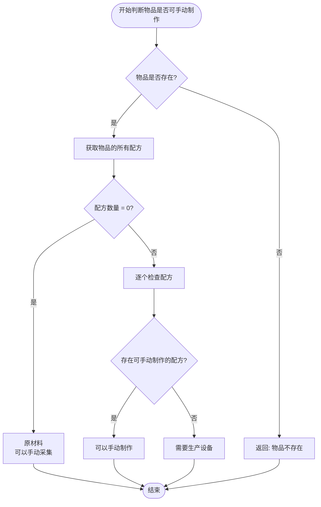
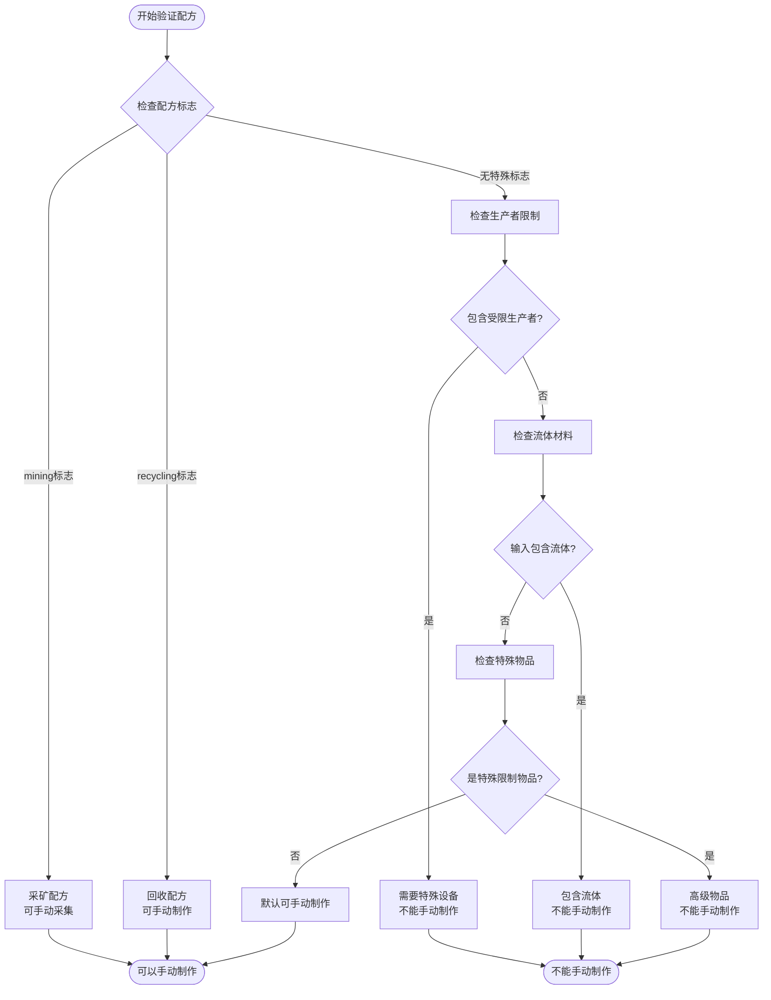
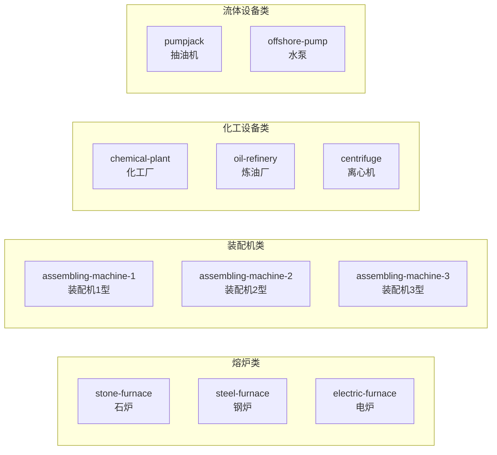
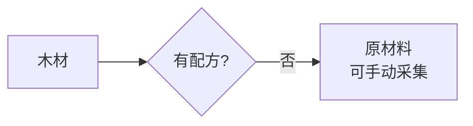
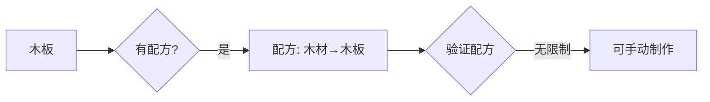
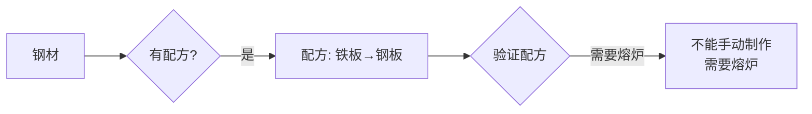
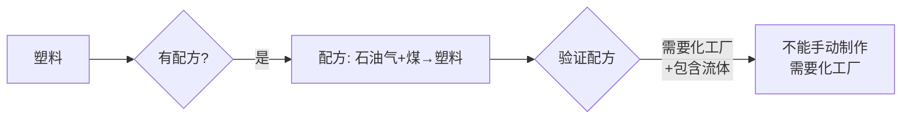

# 手动制作判断流程图

## 主流程



## 配方验证流程



## 受限生产者列表



## UI显示决策流程

```mermaid
flowchart TD
    GetItem([获取物品信息]) --> GetAllRecipes[获取所有配方]
    
    GetAllRecipes --> NoRecipe{配方数量 = 0?}
    
    NoRecipe -->|是| ShowRawMaterial[显示原材料采集界面<br/>"无需材料"]
    NoRecipe -->|否| FilterRecipes[筛选配方类型]
    
    FilterRecipes --> SplitRecipes[分离配方]
    
    SplitRecipes --> ManualRecipes[可手动制作的配方]
    SplitRecipes --> RestrictedRecipes[需要设备的配方]
    
    ManualRecipes --> HasManual{有可手动制作的配方?}
    
    HasManual -->|是| ShowManualSection[显示手动合成区域<br/>显示第一个可用配方]
    HasManual -->|否| CheckRestricted{有需要设备的配方?}
    
    RestrictedRecipes --> CheckUnlocked{检查设备是否解锁}
    
    CheckUnlocked -->|已解锁| ShowProducerSection[显示生产设备配方区域]
    CheckUnlocked -->|未解锁| HideSection[隐藏该区域]
    
    CheckRestricted -->|是| ShowWarning[显示设备需求提示]
    CheckRestricted -->|否| ShowNoRecipe[显示"无可用配方"]
```

## 实例判断流程

### 示例1: 木材 (wood)



### 示例2: 木板 (wood-plank)



### 示例3: 钢材 (steel-plate)



### 示例4: 塑料 (plastic-bar)

