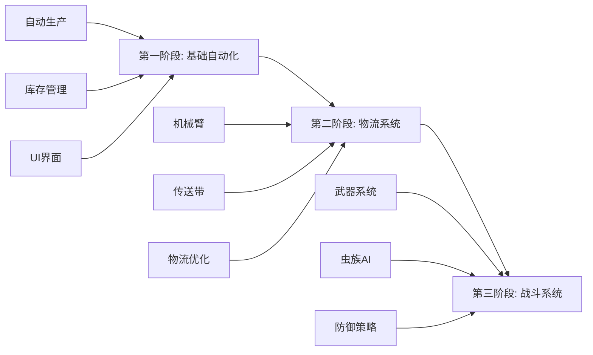

# 异星工厂游戏技术开发路线图

## 概述

本文档规划了异星工厂游戏的技术开发路线，将整个项目划分为三个主要开发阶段，从基础的自动化生产系统到复杂的物流管理，最终实现完整的塔防游戏体验。

## 开发阶段概览



## 第一阶段：基础自动化系统（4-6周）

### 1.1 核心功能

#### 1.1.1 自动化生产系统
- **设施自动获取库存**
  - 实现设施与库存系统的自动连接
  - 设施根据配方自动消耗库存物品
  - 支持多种设施类型（采矿机、熔炉、制造机等）

- **物料自动存储**
  - 生产完成的物品自动存入库存
  - 智能堆叠和分类存储
  - 库存容量管理和溢出处理

#### 1.1.2 基础设施系统
```typescript
// 设施接口设计
interface Facility {
  id: string;
  type: FacilityType;
  position: Position;
  recipe: Recipe | null;
  inputSlots: ItemSlot[];
  outputSlots: ItemSlot[];
  productionProgress: number;
  isActive: boolean;
}

// 自动化生产流程
class ProductionSystem {
  // 从库存获取原料
  fetchMaterialsFromInventory(facility: Facility): boolean;
  
  // 处理生产逻辑
  processProdution(facility: Facility, deltaTime: number): void;
  
  // 输出产品到库存
  outputToInventory(facility: Facility): boolean;
}
```

### 1.2 技术实现

#### 1.2.1 数据结构设计
- **库存系统**
  ```typescript
  interface Inventory {
    items: Map<string, InventoryItem>;
    capacity: number;
    usedSpace: number;
  }
  
  interface InventoryItem {
    itemId: string;
    quantity: number;
    maxStack: number;
  }
  ```

- **配方系统**
  ```typescript
  interface Recipe {
    id: string;
    inputs: ItemRequirement[];
    outputs: ItemOutput[];
    productionTime: number;
    energyRequired: number;
  }
  ```

#### 1.2.2 核心算法
- 生产调度算法
- 库存优化算法
- 资源分配算法

### 1.3 UI/UX设计

- **主界面布局**
  - 游戏地图视图（2D俯视图）
  - 库存面板
  - 设施信息面板
  - 生产队列显示

- **交互设计**
  - 拖拽放置设施
  - 点击选择和配置
  - 快捷键支持

### 1.4 技术栈

- **前端**
  - React 19 + TypeScript
  - Material-UI组件库
  - Canvas/WebGL渲染游戏画面

- **状态管理**
  - React Context API
  - LocalStorage持久化

### 1.5 里程碑

1. **Week 1-2**: 基础框架搭建
   - 项目结构设置
   - 基础UI布局
   - 数据模型定义

2. **Week 3-4**: 核心功能实现
   - 库存系统完成
   - 设施生产逻辑
   - 自动化流程

3. **Week 5-6**: 集成测试与优化
   - 功能集成
   - 性能优化
   - Bug修复

## 第二阶段：物流管理系统（6-8周）

### 2.1 核心功能

#### 2.1.1 机械臂系统
- **智能抓取与放置**
  - 从设施/容器抓取物品
  - 精确放置到目标位置
  - 优先级和过滤设置

- **机械臂类型**
  ```typescript
  enum InserterType {
    BASIC = 'basic',        // 基础机械臂
    FAST = 'fast',          // 快速机械臂
    LONG = 'long',          // 长臂机械臂
    STACK = 'stack',        // 集装机械臂
    FILTER = 'filter'       // 过滤机械臂
  }
  
  interface Inserter {
    type: InserterType;
    position: Position;
    rotation: number;
    pickupPoint: Position;
    dropPoint: Position;
    currentItem: Item | null;
    speed: number;
    stackSize: number;
    filter?: ItemFilter;
  }
  ```

#### 2.1.2 传送带系统
- **物品运输**
  - 单向/双向传送带
  - 速度等级（黄/红/蓝）
  - 分流器和地下传送带

- **传送带网络**
  ```typescript
  interface Belt {
    id: string;
    type: BeltType;
    segments: BeltSegment[];
    items: MovingItem[];
    speed: number;
  }
  
  interface BeltNetwork {
    belts: Map<string, Belt>;
    connections: Map<string, Connection[]>;
    
    // 路径规划
    findPath(from: Position, to: Position): BeltPath;
    
    // 物流优化
    optimizeFlow(): void;
  }
  ```

### 2.2 物流优化算法

#### 2.2.1 路径规划
- A*算法实现传送带路径规划
- 避障和最短路径计算
- 多目标点优化

#### 2.2.2 流量平衡
- 传送带负载均衡
- 瓶颈检测与告警
- 自动分流优化

```typescript
class LogisticsOptimizer {
  // 分析物流网络
  analyzeNetwork(network: BeltNetwork): AnalysisResult {
    return {
      bottlenecks: this.findBottlenecks(network),
      efficiency: this.calculateEfficiency(network),
      suggestions: this.generateOptimizations(network)
    };
  }
  
  // 自动优化布局
  autoOptimize(network: BeltNetwork): OptimizedLayout {
    // 使用遗传算法或模拟退火算法
    // 优化传送带和机械臂布局
  }
}
```

### 2.3 高级功能

#### 2.3.1 智能物流系统
- 需求预测
- 动态路由
- 优先级管理

#### 2.3.2 物流监控
- 实时流量显示
- 热力图可视化
- 性能指标仪表板

### 2.4 技术挑战

- **性能优化**
  - 大规模物品移动的渲染优化
  - 物流计算的并行处理
  - 内存管理

- **碰撞检测**
  - 高效的空间索引（四叉树）
  - 物品碰撞处理

### 2.5 里程碑

1. **Week 1-2**: 机械臂系统
   - 基础机械臂实现
   - 抓取放置逻辑
   - UI交互

2. **Week 3-4**: 传送带系统
   - 传送带基础功能
   - 物品移动动画
   - 连接系统

3. **Week 5-6**: 物流网络
   - 网络分析算法
   - 路径规划
   - 优化建议

4. **Week 7-8**: 集成与优化
   - 系统集成
   - 性能调优
   - 高级功能

## 第三阶段：战斗系统（8-10周）

### 3.1 核心功能

#### 3.1.1 武器系统
- **武器类型**
  ```typescript
  enum WeaponType {
    GUN_TURRET = 'gun_turret',           // 机枪塔
    LASER_TURRET = 'laser_turret',       // 激光塔
    FLAMETHROWER = 'flamethrower',       // 火焰喷射器
    ARTILLERY = 'artillery',             // 火炮
    ROCKET_LAUNCHER = 'rocket_launcher'  // 火箭发射器
  }
  
  interface Weapon {
    type: WeaponType;
    position: Position;
    range: number;
    damage: number;
    fireRate: number;
    ammoType: AmmoType;
    currentAmmo: number;
    target: Enemy | null;
  }
  ```

- **弹药系统**
  - 多种弹药类型
  - 自动补给机制
  - 伤害计算系统

#### 3.1.2 虫族系统
- **敌人AI**
  ```typescript
  interface Enemy {
    id: string;
    type: EnemyType;
    position: Position;
    health: number;
    maxHealth: number;
    speed: number;
    damage: number;
    behavior: AIBehavior;
    target: Structure | null;
  }
  
  class EnemyAI {
    // 路径寻找
    findPath(enemy: Enemy, target: Position): Path;
    
    // 目标选择
    selectTarget(enemy: Enemy, structures: Structure[]): Structure;
    
    // 群体行为
    swarmBehavior(enemies: Enemy[]): void;
    
    // 攻击模式
    attackPattern(enemy: Enemy): AttackAction;
  }
  ```

- **虫巢系统**
  - 虫巢生成逻辑
  - 进化系统
  - 波次攻击

### 3.2 战斗机制

#### 3.2.1 防御策略
- **防御建筑**
  - 墙壁和大门
  - 地雷和陷阱
  - 能量护盾

- **战术系统**
  ```typescript
  interface DefenseStrategy {
    // 防线布局
    layoutDefenses(area: Area): DefenseLayout;
    
    // 火力分配
    allocateFirepower(weapons: Weapon[], enemies: Enemy[]): TargetAssignment[];
    
    // 资源调度
    manageResources(defenses: Defense[]): ResourceAllocation;
  }
  ```

#### 3.2.2 进攻与防守平衡
- 污染系统影响虫族进化
- 科技树解锁更强武器
- 资源在生产和防御间的平衡

### 3.3 高级特性

#### 3.3.1 环境交互
- **污染系统**
  - 工业污染吸引虫族
  - 污染等级影响难度
  - 清洁科技研发

- **地形利用**
  - 天然屏障
  - 高地优势
  - 资源点争夺

#### 3.3.2 多人协作（可选）
- 合作防守模式
- 资源共享机制
- 联合建设

### 3.4 游戏平衡

```typescript
class GameBalance {
  // 难度曲线
  difficultyProgression: DifficultyConfig[];
  
  // 经济平衡
  economyBalance: {
    productionRates: Map<string, number>;
    consumptionRates: Map<string, number>;
    weaponCosts: Map<WeaponType, Cost>;
  };
  
  // 战斗平衡
  combatBalance: {
    weaponStats: Map<WeaponType, WeaponStats>;
    enemyStats: Map<EnemyType, EnemyStats>;
    damageModifiers: DamageTable;
  };
}
```

### 3.5 技术实现

#### 3.5.1 性能考虑
- **实体管理**
  - ECS（实体组件系统）架构
  - 对象池技术
  - LOD（细节层次）系统

- **物理模拟**
  - 简化的物理引擎
  - 弹道计算
  - 碰撞检测优化

#### 3.5.2 视觉效果
- 粒子系统（爆炸、火焰）
- 光照效果
- 战斗动画

### 3.6 里程碑

1. **Week 1-2**: 武器系统基础
   - 基础炮塔实现
   - 瞄准和射击逻辑
   - 弹药系统

2. **Week 3-4**: 虫族AI
   - 基础敌人类型
   - 寻路算法
   - 简单AI行为

3. **Week 5-6**: 战斗系统
   - 伤害计算
   - 防御建筑
   - 波次系统

4. **Week 7-8**: 平衡调整
   - 难度曲线
   - 经济平衡
   - 游戏节奏

5. **Week 9-10**: 完善与打磨
   - 视觉效果
   - 音效系统
   - 最终优化

## 技术架构演进

### 阶段一架构
```
┌─────────────────┐
│   UI Layer      │
├─────────────────┤
│  Game Logic     │
├─────────────────┤
│  Data Layer     │
└─────────────────┘
```

### 阶段二架构
```
┌─────────────────┐
│   UI Layer      │
├─────────────────┤
│ Logistics Engine│
├─────────────────┤
│  Game Logic     │
├─────────────────┤
│  Data Layer     │
└─────────────────┘
```

### 阶段三架构
```
┌─────────────────┐
│   UI Layer      │
├─────────────────┤
│  Combat System  │
├─────────────────┤
│ Logistics Engine│
├─────────────────┤
│  Game Logic     │
├─────────────────┤
│  Data Layer     │
└─────────────────┘
```

## 风险管理

### 技术风险
1. **性能瓶颈**
   - 缓解：早期性能测试，使用Web Workers
   - 备选：降低视觉效果，限制实体数量

2. **复杂度管理**
   - 缓解：模块化设计，清晰的接口定义
   - 备选：简化部分功能，分阶段实现

3. **浏览器兼容性**
   - 缓解：使用标准Web API，充分测试
   - 备选：提供降级方案

### 项目风险
1. **进度延期**
   - 缓解：预留缓冲时间，敏捷开发
   - 备选：调整功能范围

2. **技术债务**
   - 缓解：代码审查，重构时间
   - 备选：技术债务清理周期

## 总结

本技术路线图将异星工厂游戏开发划分为三个递进的阶段：

1. **第一阶段**建立游戏的核心循环：自动化生产和库存管理
2. **第二阶段**引入复杂的物流系统，提升游戏深度
3. **第三阶段**加入战斗元素，完成塔防游戏体验

每个阶段都有明确的目标、技术实现方案和里程碑，确保项目能够稳步推进。通过模块化的设计和清晰的架构演进路径，我们可以在保证代码质量的同时，逐步构建一个功能完整、体验优秀的游戏。

## 附录：技术选型理由

### 前端框架：React + TypeScript
- 成熟的生态系统
- 强类型支持
- 组件化开发
- 良好的性能

### 渲染方案：Canvas/WebGL
- 高性能2D渲染
- 灵活的图形控制
- 支持大量实体

### 状态管理：Context API + LocalStorage
- 轻量级解决方案
- 无需额外依赖
- 满足当前需求

### UI组件：Material-UI
- 完整的组件库
- 响应式设计
- 良好的文档支持